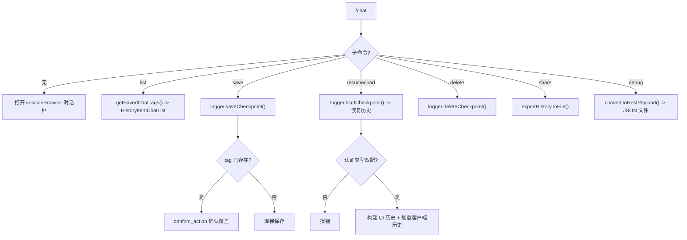

# chatCommand.ts

> 管理对话检查点的保存、恢复、删除、导出和调试请求导出

## 概述

`chatCommand` 实现了 `/chat` 斜杠命令以及一套完整的对话检查点管理子命令（`list`、`save`、`resume`/`load`、`delete`、`share`）。还导出了 `debugCommand`（`/chat debug`）用于导出最近的 API 请求。`chatResumeSubCommands` 被 `resumeCommand` 复用，使 `/resume` 命令也拥有相同的检查点操作能力。

## 架构图（mermaid）

## 主要导出

| 导出名 | 类型 | 说明 |
|--------|------|------|
| `chatCommand` | `SlashCommand` | `/chat` 顶层命令，默认打开会话浏览器 |
| `debugCommand` | `SlashCommand` | 导出最近 API 请求为 JSON |
| `checkpointSubCommands` | `SlashCommand[]` | 检查点子命令数组 |
| `chatResumeSubCommands` | `SlashCommand[]` | 带 `suggestionGroup` 标记的检查点子命令（供 `/resume` 复用） |

## 核心逻辑

1. **getSavedChatTags()**：扫描项目临时目录中 `checkpoint-*.json` 文件，解析标签名和修改时间，按时间排序返回 `ChatDetail[]`。
2. **list**：调用 `getSavedChatTags()` 并渲染 `HistoryItemChatList`。
3. **save**：
   - 校验标签参数。
   - 如果标签已存在且未确认覆盖（`overwriteConfirmed`），返回 `confirm_action` 带 React 组件的确认提示。
   - 获取聊天历史，检查长度是否超过初始长度。
   - 调用 `logger.saveCheckpoint()` 保存历史和认证类型。
4. **resume**（别名 `load`）：
   - 加载检查点并检查认证类型一致性。
   - 将 Gemini 历史（跳过初始系统消息）转换为 UI 历史项。
   - 返回 `load_history` 动作，同时包含 UI 历史和客户端历史。
   - 补全函数按修改时间降序提供标签名。
5. **delete**：调用 `logger.deleteCheckpoint(tag)` 删除检查点文件。
6. **share**：导出对话到文件，支持 `.md` 和 `.json` 格式。无参数时使用带时间戳的默认文件名。
7. **debug**：获取最近的 API 请求，通过 `convertToRestPayload()` 转换为 REST 格式，写入 `gcli-request-*.json` 文件。
8. **chatResumeSubCommands**：将检查点子命令添加 `suggestionGroup: 'checkpoints'` 标记，附加一个隐藏的 `checkpoints` 兼容命令，供 `/resume` 使用。

## 内部依赖

| 模块 | 用途 |
|------|------|
| `./types.js` | `CommandContext`、`SlashCommand`、`SlashCommandActionReturn`、`CommandKind` |
| `../types.js` | `HistoryItemWithoutId`、`HistoryItemChatList`、`ChatDetail`、`MessageType` |
| `../semantic-colors.js` | `theme` |
| `../utils/historyExportUtils.js` | `exportHistoryToFile` |

## 外部依赖

| 包 | 用途 |
|----|------|
| `node:fs/promises` | 文件系统操作 |
| `node:path` | 路径处理 |
| `react` | `React.createElement`（确认对话框 UI） |
| `ink` | `Text` 组件 |
| `@google/gemini-cli-core` | `decodeTagName`、`MessageActionReturn`、`INITIAL_HISTORY_LENGTH`、`convertToRestPayload` |
