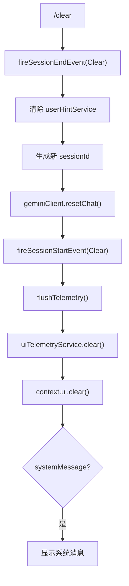

# clearCommand.ts

> 清除屏幕和会话历史，重置聊天状态

## 概述

`clearCommand` 实现了 `/clear` 斜杠命令，执行完整的会话重置流程：触发 SessionEnd 钩子、清除用户引导提示、生成新的 Session ID、重置聊天客户端、触发 SessionStart 钩子、刷新遥测数据，最后清除 UI 显示。

## 架构图（mermaid）

## 主要导出

| 导出名 | 类型 | 说明 |
|--------|------|------|
| `clearCommand` | `SlashCommand` | `/clear` 命令，自动执行 |

## 核心逻辑

1. 触发 `SessionEnd` 钩子事件（原因为 `Clear`）。
2. 清除 `userHintService` 中的用户引导提示。
3. 生成新的 `randomUUID` 作为新会话 ID，通过 `config.setSessionId()` 设置。
4. 调用 `geminiClient.resetChat()` 重置聊天历史（在新会话 ID 之后执行，确保 `ChatRecordingService` 使用新 ID）。
5. 触发 `SessionStart` 钩子事件，获取可能的系统消息。
6. 通过 `setImmediate` 等待事件循环处理待定的遥测操作，然后调用 `flushTelemetry()` 确保数据持久化。
7. 清除 UI 遥测服务和界面显示，如有 `systemMessage` 则展示。

## 内部依赖

| 模块 | 用途 |
|------|------|
| `./types.js` | `CommandKind`、`SlashCommand` |
| `../types.js` | `MessageType` |

## 外部依赖

| 包 | 用途 |
|----|------|
| `node:crypto` | `randomUUID` 生成新会话 ID |
| `@google/gemini-cli-core` | `uiTelemetryService`、`SessionEndReason`、`SessionStartSource`、`flushTelemetry` |
