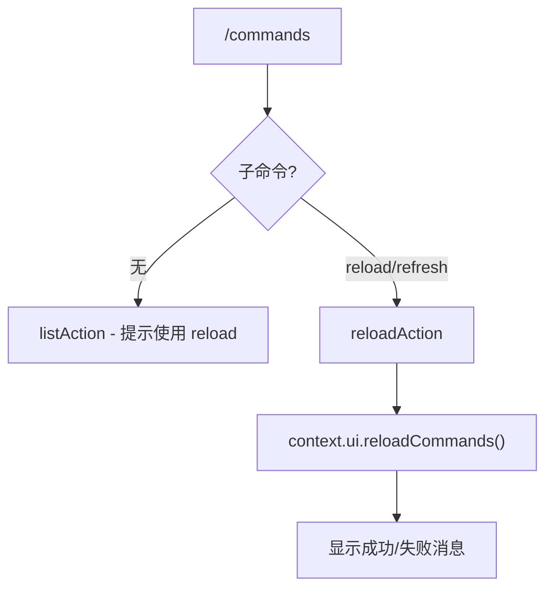

# commandsCommand.ts

> 管理自定义斜杠命令定义，支持从 TOML 文件重载

## 概述

`commandsCommand` 实现了 `/commands` 斜杠命令及其 `reload` 子命令。默认行为提示用户使用子命令；`reload`（别名 `refresh`）触发所有斜杠命令的完整重新发现和重载，包括用户/项目级 TOML 文件、MCP 提示和扩展命令。

## 架构图（mermaid）

## 主要导出

| 导出名 | 类型 | 说明 |
|--------|------|------|
| `commandsCommand` | `SlashCommand` | `/commands` 顶层命令 |

## 核心逻辑

1. **默认行为**（`listAction`）：返回提示信息，引导用户使用 `/commands reload`。
2. **reload 子命令**（`reloadAction`）：调用 `context.ui.reloadCommands()` 触发全量命令重载，成功时添加 `INFO` 消息，异常时添加 `ERROR` 消息。

## 内部依赖

| 模块 | 用途 |
|------|------|
| `./types.js` | `CommandContext`、`SlashCommand`、`SlashCommandActionReturn`、`CommandKind` |
| `../types.js` | `MessageType`、`HistoryItemError`、`HistoryItemInfo` |

## 外部依赖

无
