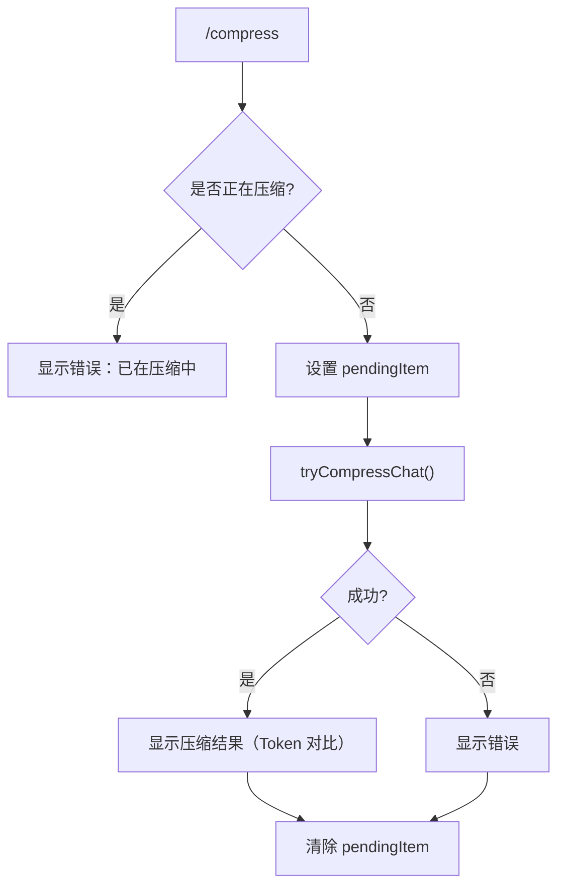

# compressCommand.ts

> 压缩聊天上下文，用摘要替代原始历史以节省 Token

## 概述

`compressCommand` 实现了 `/compress` 斜杠命令（别名 `summarize`、`compact`），通过调用 Gemini 客户端的 `tryCompressChat()` 方法将当前对话历史压缩为摘要。在压缩过程中显示待处理指示器，完成后展示压缩前后的 Token 数量对比。

## 架构图（mermaid）

## 主要导出

| 导出名 | 类型 | 说明 |
|--------|------|------|
| `compressCommand` | `SlashCommand` | `/compress` 命令，自动执行 |

## 核心逻辑

1. 检查 `ui.pendingItem` 防止重复压缩。
2. 设置 `HistoryItemCompression`（`isPending: true`）作为待处理项展示进度。
3. 生成带时间戳的 `promptId`，调用 `geminiClient.tryCompressChat(promptId, true)` 执行强制压缩。
4. 成功时展示 `originalTokenCount` 和 `newTokenCount` 以及压缩状态；失败时展示错误信息。
5. 在 `finally` 块中清除 `pendingItem`。

## 内部依赖

| 模块 | 用途 |
|------|------|
| `../types.js` | `MessageType`、`HistoryItemCompression` |
| `./types.js` | `CommandKind`、`SlashCommand` |

## 外部依赖

无
