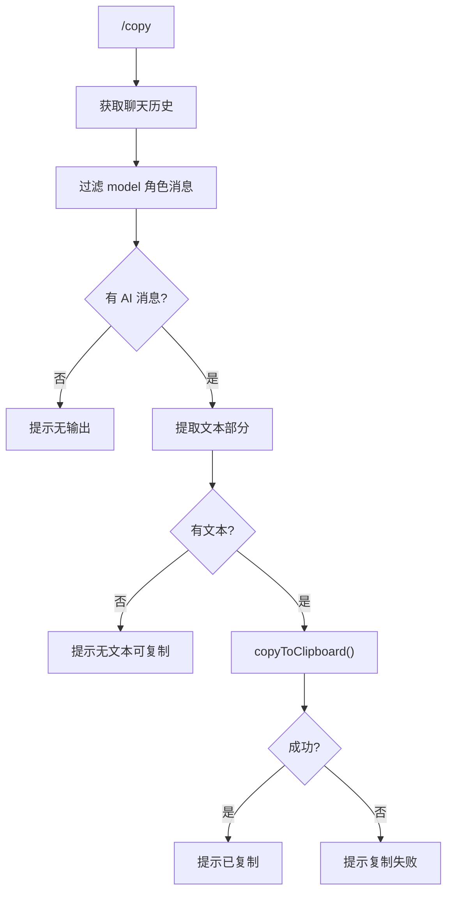

# copyCommand.ts

> 将最近一次 AI 输出复制到系统剪贴板

## 概述

`copyCommand` 实现了 `/copy` 斜杠命令，从聊天历史中获取最后一条 AI（model 角色）消息的文本内容，并使用平台剪贴板工具将其复制到系统剪贴板。

## 架构图（mermaid）

## 主要导出

| 导出名 | 类型 | 说明 |
|--------|------|------|
| `copyCommand` | `SlashCommand` | `/copy` 命令，自动执行 |

## 核心逻辑

1. 从 `geminiClient.getChat().getHistory()` 获取历史记录。
2. 过滤 `role === 'model'` 的消息，取最后一条。
3. 提取所有 `text` 部分并拼接。
4. 调用 `copyToClipboard()` 工具函数执行实际的剪贴板操作，该函数会根据用户设置选择合适的剪贴板命令。

## 内部依赖

| 模块 | 用途 |
|------|------|
| `./types.js` | `CommandKind`、`SlashCommand`、`SlashCommandActionReturn` |
| `../utils/commandUtils.js` | `copyToClipboard` |

## 外部依赖

| 包 | 用途 |
|----|------|
| `@google/gemini-cli-core` | `debugLogger` |
