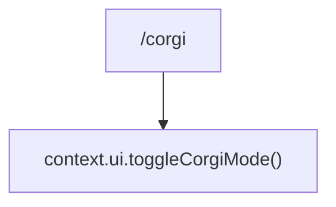

# corgiCommand.ts

> 切换 Corgi 彩蛋显示模式

## 概述

`corgiCommand` 实现了隐藏的 `/corgi` 斜杠命令，用于切换一个特殊的 Corgi（柯基犬）显示模式。该命令标记为 `hidden: true`，不会出现在命令建议列表中。

## 架构图（mermaid）

## 主要导出

| 导出名 | 类型 | 说明 |
|--------|------|------|
| `corgiCommand` | `SlashCommand` | `/corgi` 隐藏命令，自动执行 |

## 核心逻辑

调用 `context.ui.toggleCorgiMode()` 切换 Corgi 模式的开关状态。

## 内部依赖

| 模块 | 用途 |
|------|------|
| `./types.js` | `CommandKind`、`SlashCommand` |

## 外部依赖

无
