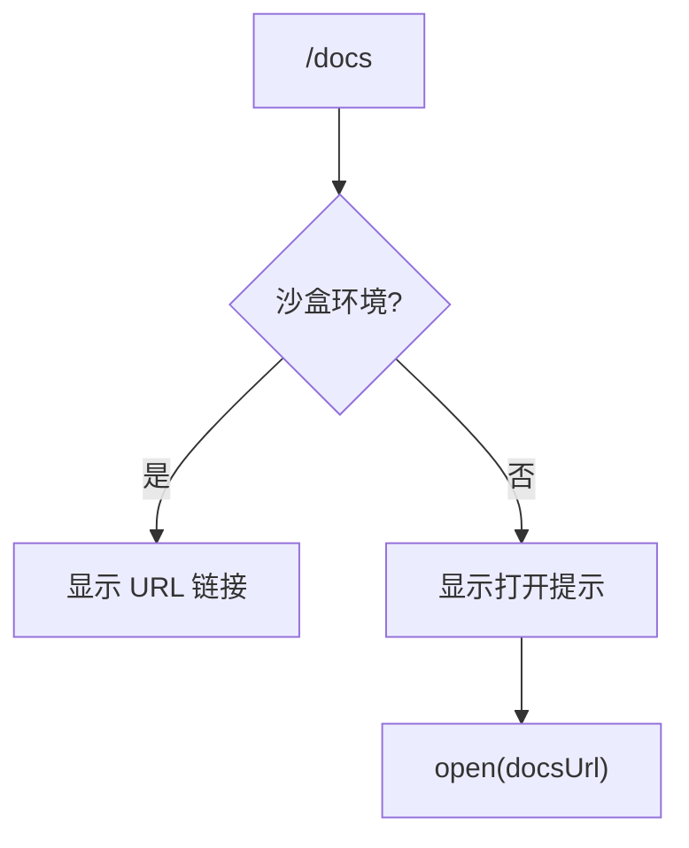

# docsCommand.ts

> 在浏览器中打开 Gemini CLI 完整文档

## 概述

`docsCommand` 实现了 `/docs` 斜杠命令，将 Gemini CLI 文档页面（`https://goo.gle/gemini-cli-docs`）在用户的默认浏览器中打开。在沙盒环境下改为仅显示 URL 链接。

## 架构图（mermaid）

## 主要导出

| 导出名 | 类型 | 说明 |
|--------|------|------|
| `docsCommand` | `SlashCommand` | `/docs` 命令，自动执行 |

## 核心逻辑

1. 检查环境变量 `SANDBOX`，如果存在且不为 `sandbox-exec`，则仅在终端显示文档 URL。
2. 否则调用 `open()` 在默认浏览器中打开文档页面。

## 内部依赖

| 模块 | 用途 |
|------|------|
| `./types.js` | `CommandContext`、`SlashCommand`、`CommandKind` |
| `../types.js` | `MessageType` |

## 外部依赖

| 包 | 用途 |
|----|------|
| `open` | 打开浏览器 |
| `node:process` | 环境变量检查 |
