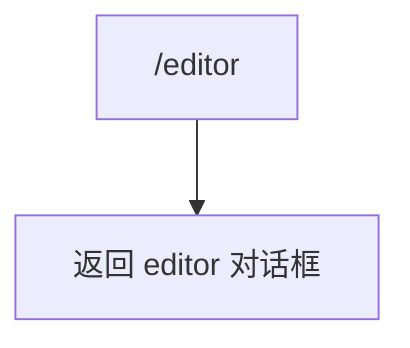

# editorCommand.ts

> 设置外部编辑器偏好

## 概述

`editorCommand` 实现了 `/editor` 斜杠命令，打开编辑器选择对话框，让用户配置首选的外部编辑器。

## 架构图（mermaid）

## 主要导出

| 导出名 | 类型 | 说明 |
|--------|------|------|
| `editorCommand` | `SlashCommand` | `/editor` 命令，自动执行 |

## 核心逻辑

直接返回 `OpenDialogActionReturn`，指定打开 `editor` 对话框。

## 内部依赖

| 模块 | 用途 |
|------|------|
| `./types.js` | `CommandKind`、`OpenDialogActionReturn`、`SlashCommand` |

## 外部依赖

无
