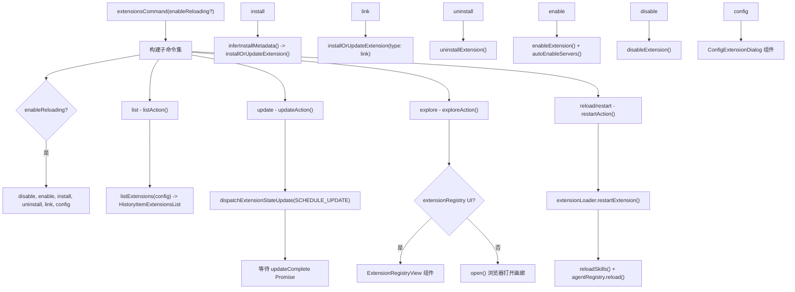

# extensionsCommand.ts

> 全面管理扩展的生命周期（列表、安装、卸载、链接、更新、启用、禁用、配置、探索）

## 概述

`extensionsCommand` 是一个工厂函数，根据是否启用扩展重载功能动态构建 `/extensions` 斜杠命令及其子命令集。提供完整的扩展生命周期管理：列出已安装扩展、从 Git 仓库或本地路径安装/链接扩展、卸载、更新、启用/禁用（支持 user/workspace/session 三种作用域）、配置扩展设置，以及浏览扩展库。这是整个命令系统中最大的文件（约 882 行）。

## 架构图（mermaid）

## 主要导出

| 导出名 | 类型 | 说明 |
|--------|------|------|
| `extensionsCommand` | `(enableExtensionReloading?: boolean) => SlashCommand` | 工厂函数 |
| `completeExtensions` | `(context, partialArg) => string[]` | 扩展名补全（用于测试） |
| `completeExtensionsAndScopes` | `(context, partialArg) => string[]` | 扩展名 + 作用域补全 |

## 核心逻辑

1. **list**（默认）：调用 `listExtensions(config)` 获取已安装扩展列表，无扩展时提示使用 `/extensions explore`。
2. **update**：
   - 支持 `--all` 更新全部或指定扩展名称列表。
   - 使用 `Promise` + `dispatchExtensionStateUpdate({ type: 'SCHEDULE_UPDATE' })` 异步调度更新。
   - 更新期间显示 `pendingItem`，完成后展示结果列表。
3. **reload/restart**（别名）：
   - 支持 `--all` 或指定扩展名称。
   - 仅重启活跃扩展。
   - 使用 `Promise.allSettled()` 并行重启，统计成功/失败。
   - 成功后重载技能和代理注册表。
4. **explore**：
   - 如果启用了实验性 `extensionRegistry` 设置，渲染 `ExtensionRegistryView` 自定义对话框组件。
   - 否则在浏览器中打开 `https://geminicli.com/extensions/`（沙盒环境下仅显示 URL）。
5. **install**：验证源地址（URL 或文件路径），调用 `inferInstallMetadata()` 推断安装元数据，执行 `installOrUpdateExtension()`。
6. **link**：验证本地路径存在性，以 `type: 'link'` 方式调用安装函数。
7. **uninstall**：支持 `--all` 或指定名称列表，逐个调用 `uninstallExtension()`。
8. **enable/disable**：
   - 通过 `getEnableDisableContext()` 统一解析参数和作用域（`user`/`workspace`/`session`）。
   - 支持 `--all` 批量操作。
   - `enable` 时额外通过 `McpServerEnablementManager.autoEnableServers()` 自动启用关联的 MCP 服务器。
9. **config**：解析扩展名、设置键和作用域参数，渲染 `ConfigExtensionDialog` 自定义对话框。
10. **补全**：`completeExtensions()` 根据调用命令名过滤扩展（enable 过滤非活跃、disable/reload 过滤活跃）；`completeExtensionsAndScopes()` 在扩展名后附加三种作用域选项。

## 内部依赖

| 模块 | 用途 |
|------|------|
| `./types.js` | `CommandContext`、`SlashCommand`、`SlashCommandActionReturn`、`CommandKind` |
| `../types.js` | `emptyIcon`、`MessageType`、`HistoryItemExtensionsList`、`HistoryItemInfo` |
| `../semantic-colors.js` | `theme` |
| `../../config/extension.js` | `ExtensionUpdateInfo` |
| `../../config/extension-manager.js` | `ExtensionManager`、`inferInstallMetadata` |
| `../../config/settings.js` | `SettingScope` |
| `../../config/mcp/mcpServerEnablement.js` | `McpServerEnablementManager` |
| `../../config/extensions/extensionSettings.js` | `ExtensionSettingScope` |
| `../../commands/extensions/utils.js` | `ConfigLogger` |
| `../components/ConfigExtensionDialog.js` | `ConfigExtensionDialog` 组件 |
| `../components/views/ExtensionRegistryView.js` | `ExtensionRegistryView` 组件 |

## 外部依赖

| 包 | 用途 |
|----|------|
| `react` | `React.createElement` 创建对话框组件 |
| `open` | 打开浏览器 |
| `node:process` | 环境变量检查 |
| `node:fs/promises` | `stat` 文件系统检查 |
| `@google/gemini-cli-core` | `debugLogger`、`listExtensions`、`getErrorMessage`、`ExtensionInstallMetadata` |
