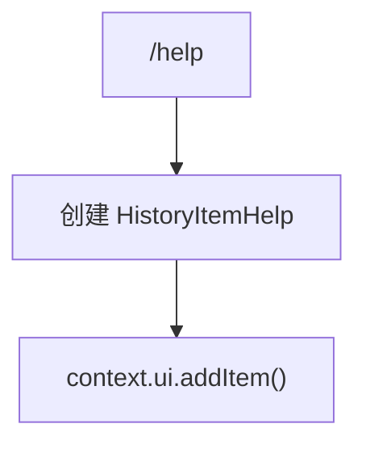

# helpCommand.ts

> 显示 Gemini CLI 帮助信息

## 概述

`helpCommand` 实现了 `/help` 斜杠命令，在 UI 中添加一个 `HELP` 类型的历史记录项，触发帮助信息面板的渲染。

## 架构图（mermaid）

## 主要导出

| 导出名 | 类型 | 说明 |
|--------|------|------|
| `helpCommand` | `SlashCommand` | `/help` 命令，自动执行 |

## 核心逻辑

创建一个 `HistoryItemHelp` 对象（包含当前时间戳），添加到 UI 历史记录中，由 UI 层的渲染组件负责展示帮助内容。

## 内部依赖

| 模块 | 用途 |
|------|------|
| `./types.js` | `CommandKind`、`SlashCommand` |
| `../types.js` | `MessageType`、`HistoryItemHelp` |

## 外部依赖

无
