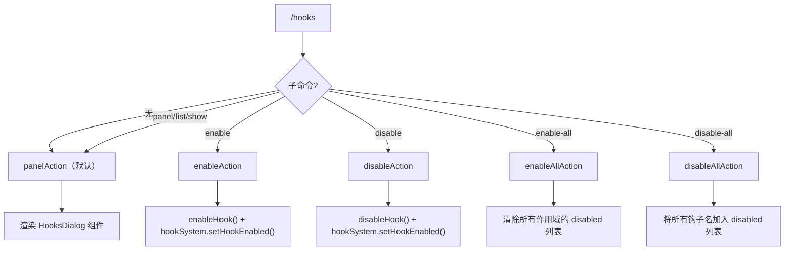

# hooksCommand.ts

> 管理钩子（Hook）的查看、启用、禁用和批量操作

## 概述

`hooksCommand` 实现了 `/hooks` 斜杠命令及其子命令（`panel`/`list`/`show`、`enable`、`disable`、`enable-all`、`disable-all`），提供完整的钩子生命周期管理功能。通过 `HookSystem` 与 `Settings` 协作，在用户/工作区范围内控制钩子的启用状态。

## 架构图（mermaid）

## 主要导出

| 导出名 | 类型 | 说明 |
|--------|------|------|
| `hooksCommand` | `SlashCommand` | `/hooks` 顶层命令，默认执行 `panel` 子命令 |

## 核心逻辑

1. **panel**（别名 `list`/`show`）：获取所有钩子列表，通过 `createElement(HooksDialog)` 渲染为自定义对话框组件。
2. **enable**：调用 `enableHook()` 更新设置，成功后通过 `hookSystem.setHookEnabled()` 同步运行时状态。
3. **disable**：根据是否存在工作区选择 `SettingScope`，调用 `disableHook()` 更新设置并同步运行时。
4. **enable-all**：遍历 Workspace 和 User 两个 scope，将 `hooksConfig.disabled` 设为空数组，逐个启用已禁用的钩子。
5. **disable-all**：收集所有钩子名称，写入 `hooksConfig.disabled`，逐个禁用已启用的钩子。
6. 补全函数 `completeEnabledHookNames` 和 `completeDisabledHookNames` 分别为 `disable` 和 `enable` 提供已启用/已禁用钩子名的前缀匹配。

## 内部依赖

| 模块 | 用途 |
|------|------|
| `./types.js` | `SlashCommand`、`CommandContext`、`OpenCustomDialogActionReturn`、`CommandKind` |
| `../../config/settings.js` | `SettingScope`、`isLoadableSettingScope` |
| `../../utils/hookSettings.js` | `enableHook`、`disableHook` |
| `../../utils/hookUtils.js` | `renderHookActionFeedback` |
| `../components/HooksDialog.js` | `HooksDialog` 组件 |

## 外部依赖

| 包 | 用途 |
|----|------|
| `react` | `createElement` 创建对话框组件 |
| `@google/gemini-cli-core` | `HookRegistryEntry`、`MessageActionReturn`、`getErrorMessage` |
