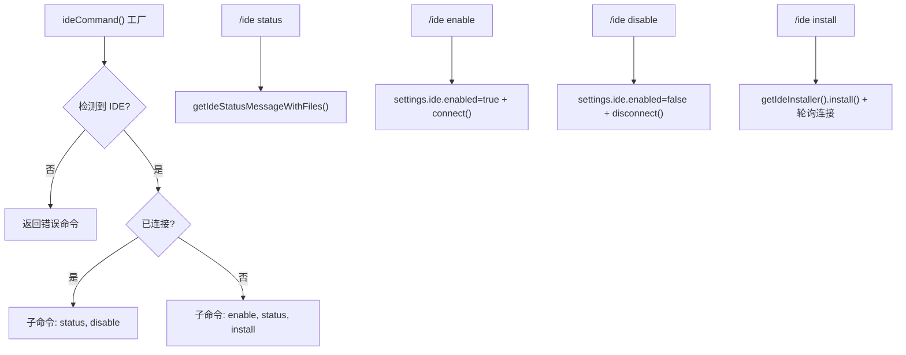

# ideCommand.ts

> 管理 IDE 集成（状态查看、启用、禁用、安装伴侣扩展）

## 概述

`ideCommand` 是一个工厂函数（异步），根据当前 IDE 环境动态生成 `/ide` 斜杠命令及其子命令。支持 Antigravity、VS Code 及其分支 IDE。如果不在支持的 IDE 中运行，返回仅包含错误提示的命令。根据连接状态动态调整可用子命令。

## 架构图（mermaid）

## 主要导出

| 导出名 | 类型 | 说明 |
|--------|------|------|
| `ideCommand` | `() => Promise<SlashCommand>` | 异步工厂函数，返回 `/ide` 命令 |

## 核心逻辑

1. **工厂模式**：异步获取 `IdeClient` 实例和当前 IDE，根据环境动态构建命令。
2. **status**：显示连接状态（绿/黄/红图标），已连接时还列出 IDE 中打开的文件列表。
3. **install**：调用 `getIdeInstaller(currentIDE).install()` 安装伴侣扩展，安装成功后轮询最多 5 秒等待连接建立。
4. **enable**：写入 `ide.enabled = true` 设置，调用 `setIdeModeAndSyncConnection()` 连接 IDE。
5. **disable**：写入 `ide.enabled = false` 设置，断开 IDE 连接。
6. `setIdeModeAndSyncConnection()` 内部同时调用 `logIdeConnection` 记录连接事件。
7. `formatFileList()` 对打开文件列表做智能显示：重名文件附加父目录区分，活动文件标记 `(active)`。

## 内部依赖

| 模块 | 用途 |
|------|------|
| `./types.js` | `CommandContext`、`SlashCommand`、`SlashCommandActionReturn`、`CommandKind` |
| `../../config/settings.js` | `SettingScope` |

## 外部依赖

| 包 | 用途 |
|----|------|
| `node:path` | 文件路径处理 |
| `@google/gemini-cli-core` | `Config`、`IdeClient`、`File`、`logIdeConnection`、`IdeConnectionEvent`、`IdeConnectionType`、`getIdeInstaller`、`IDEConnectionStatus`、`ideContextStore`、`GEMINI_CLI_COMPANION_EXTENSION_NAME` |
