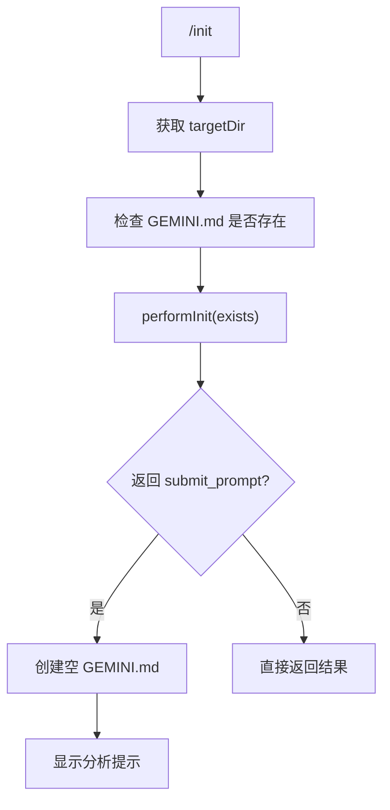

# initCommand.ts

> 分析项目并创建定制化的 GEMINI.md 文件

## 概述

`initCommand` 实现了 `/init` 斜杠命令，通过调用 `performInit()` 核心函数分析当前项目结构，并在项目根目录创建 `GEMINI.md` 记忆文件。如果文件已存在，`performInit` 会返回相应的提示或确认流程。

## 架构图（mermaid）

## 主要导出

| 导出名 | 类型 | 说明 |
|--------|------|------|
| `initCommand` | `SlashCommand` | `/init` 命令，自动执行 |

## 核心逻辑

1. 通过 `config.getTargetDir()` 获取目标目录。
2. 使用 `fs.existsSync()` 检查 `GEMINI.md` 是否已存在。
3. 调用 `performInit(exists)` 获取操作指令。
4. 如果返回 `submit_prompt` 类型，先创建空的 `GEMINI.md` 文件，然后返回该指令让模型分析项目并填充内容。

## 内部依赖

| 模块 | 用途 |
|------|------|
| `./types.js` | `CommandContext`、`SlashCommand`、`SlashCommandActionReturn`、`CommandKind` |

## 外部依赖

| 包 | 用途 |
|----|------|
| `node:fs` | 文件存在检查和创建 |
| `node:path` | 路径拼接 |
| `@google/gemini-cli-core` | `performInit` |
