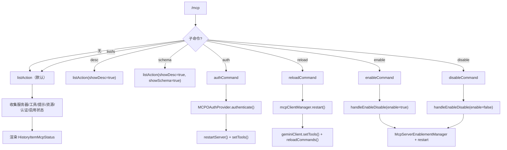

# mcpCommand.ts

> 管理 MCP（Model Context Protocol）服务器及其工具、认证和启用状态

## 概述

`mcpCommand` 实现了 `/mcp` 斜杠命令及丰富的子命令集（`list`、`desc`、`schema`、`auth`、`reload`、`enable`、`disable`），用于全面管理 MCP 服务器的生命周期。支持 OAuth 认证、服务器启用/禁用（支持 `--session` 标志）、工具/提示/资源的查看和描述展示。

## 架构图（mermaid）

## 主要导出

| 导出名 | 类型 | 说明 |
|--------|------|------|
| `mcpCommand` | `SlashCommand` | `/mcp` 顶层命令，默认执行列表视图 |

## 核心逻辑

1. **list/desc/schema**：从 `ToolRegistry`、`PromptRegistry`、`ResourceRegistry` 收集所有 MCP 工具、提示和资源；通过 `MCPOAuthTokenStorage` 检查各服务器的 OAuth 认证状态；通过 `McpServerEnablementManager` 获取启用状态；构建 `HistoryItemMcpStatus` 展示。
2. **auth**：无参数时列出所有支持 OAuth 的服务器；有参数时动态导入 `MCPOAuthProvider` 执行认证流程，成功后重启服务器并刷新工具和命令。
3. **reload**：调用 `mcpClientManager.restart()` 重启所有服务器，更新 Gemini 客户端工具集并重载命令。
4. **enable/disable**：通过 `handleEnableDisable()` 共享逻辑处理；支持 `--session` 标志进行会话级操作；`enable` 时额外检查管理员策略和允许/排除列表；操作完成后重启 MCP 服务器并刷新工具。
5. 补全函数根据当前启用状态过滤服务器名称。

## 内部依赖

| 模块 | 用途 |
|------|------|
| `./types.js` | `SlashCommand`、`SlashCommandActionReturn`、`CommandContext`、`CommandKind` |
| `../types.js` | `MessageType`、`HistoryItemMcpStatus` |
| `../../config/mcp/mcpServerEnablement.js` | `McpServerEnablementManager`、`normalizeServerId`、`canLoadServer` |
| `../../config/settings.js` | `loadSettings` |

## 外部依赖

| 包 | 用途 |
|----|------|
| `@google/gemini-cli-core` | `DiscoveredMCPTool`、`getMCPDiscoveryState`、`getMCPServerStatus`、`MCPDiscoveryState`、`MCPServerStatus`、`getErrorMessage`、`MCPOAuthTokenStorage`、`mcpServerRequiresOAuth`、`CoreEvent`、`coreEvents`、`MCPOAuthProvider`（动态导入）、`MessageActionReturn` |
