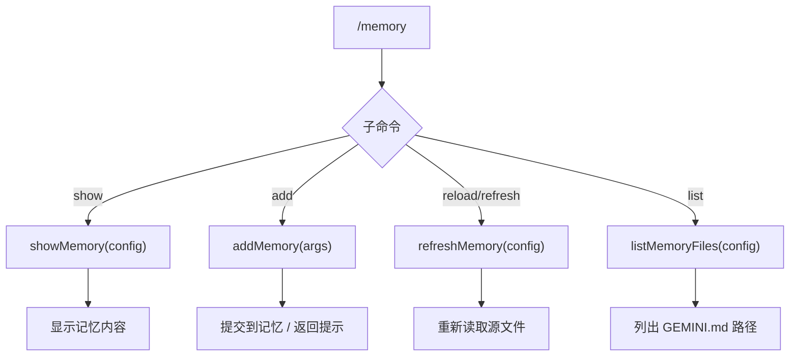

# memoryCommand.ts

> 管理 GEMINI.md 记忆文件的查看、添加、重载和列表

## 概述

`memoryCommand` 实现了 `/memory` 斜杠命令及其子命令（`show`、`add`、`reload`/`refresh`、`list`），用于与 Gemini CLI 的记忆系统（GEMINI.md 文件）交互。支持查看当前记忆内容、添加新内容、从源文件重载，以及列出所有使用中的记忆文件路径。

## 架构图（mermaid）

## 主要导出

| 导出名 | 类型 | 说明 |
|--------|------|------|
| `memoryCommand` | `SlashCommand` | `/memory` 顶层命令（无默认 action） |

## 核心逻辑

1. **show**：调用 `showMemory(config)` 获取当前合并后的记忆内容并显示。
2. **add**：调用 `addMemory(args)`，如果返回 `message` 类型则直接返回；否则显示保存提示并返回核心指令。
3. **reload**（别名 `refresh`）：调用 `refreshMemory(config)` 异步重新读取所有 GEMINI.md 源文件，成功/失败都有对应的 UI 反馈。
4. **list**：调用 `listMemoryFiles(config)` 列出当前使用的所有 GEMINI.md 文件路径。

## 内部依赖

| 模块 | 用途 |
|------|------|
| `../types.js` | `MessageType` |
| `./types.js` | `CommandKind`、`SlashCommand`、`SlashCommandActionReturn` |

## 外部依赖

| 包 | 用途 |
|----|------|
| `@google/gemini-cli-core` | `addMemory`、`listMemoryFiles`、`refreshMemory`、`showMemory` |
