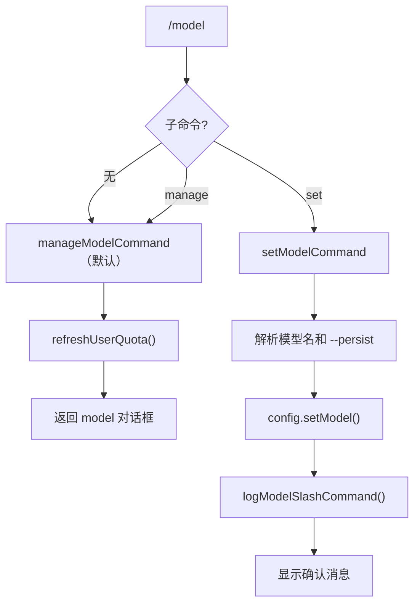

# modelCommand.ts

> 管理模型配置（设置模型、打开配置对话框）

## 概述

`modelCommand` 实现了 `/model` 斜杠命令及其子命令（`manage`、`set`），用于查看和切换当前使用的 AI 模型。`manage` 打开模型配置对话框；`set` 通过命令行直接设置模型名称，支持 `--persist` 标志持久化配置。

## 架构图（mermaid）

## 主要导出

| 导出名 | 类型 | 说明 |
|--------|------|------|
| `modelCommand` | `SlashCommand` | `/model` 顶层命令，默认执行 `manage` |

## 核心逻辑

1. **manage**（默认）：先调用 `config.refreshUserQuota()` 刷新用户配额信息，然后返回 `model` 对话框。
2. **set**：解析参数中的模型名称和 `--persist` 标志；调用 `config.setModel(modelName, !persist)` 设置模型（第二个参数为 `sessionOnly`）；通过 `logModelSlashCommand` 记录遥测事件。

## 内部依赖

| 模块 | 用途 |
|------|------|
| `./types.js` | `CommandContext`、`CommandKind`、`SlashCommand` |
| `../types.js` | `MessageType` |

## 外部依赖

| 包 | 用途 |
|----|------|
| `@google/gemini-cli-core` | `ModelSlashCommandEvent`、`logModelSlashCommand` |
