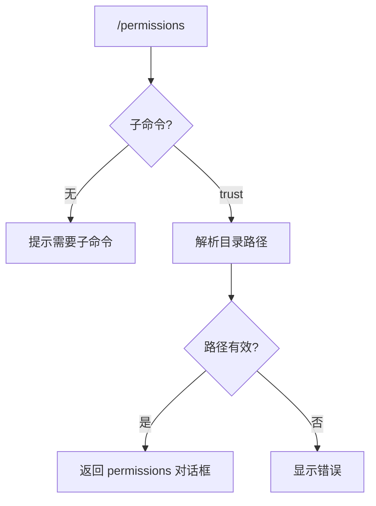

# permissionsCommand.ts

> 管理文件夹信任设置和权限

## 概述

`permissionsCommand` 实现了 `/permissions` 斜杠命令及 `trust` 子命令，用于管理文件夹信任设置。用户可以指定目录路径（或使用当前工作目录）打开权限管理对话框。

## 架构图（mermaid）

## 主要导出

| 导出名 | 类型 | 说明 |
|--------|------|------|
| `permissionsCommand` | `SlashCommand` | `/permissions` 顶层命令 |

## 核心逻辑

1. **trust 子命令**：
   - 无参数时使用 `process.cwd()` 作为目标目录。
   - 有参数时通过 `expandHomeDir()` 展开 `~` 前缀，再用 `path.resolve()` 转为绝对路径。
   - 验证路径存在且为目录（`fs.statSync().isDirectory()`）。
   - 返回 `permissions` 对话框，传入 `targetDirectory` 属性。
2. **默认 action**：无有效子命令时显示用法提示。

## 内部依赖

| 模块 | 用途 |
|------|------|
| `./types.js` | `OpenDialogActionReturn`、`SlashCommand`、`SlashCommandActionReturn`、`CommandKind` |
| `../utils/directoryUtils.js` | `expandHomeDir` |

## 外部依赖

| 包 | 用途 |
|----|------|
| `node:process` | `process.cwd()` |
| `node:path` | 路径解析 |
| `node:fs` | 文件系统检查 |
