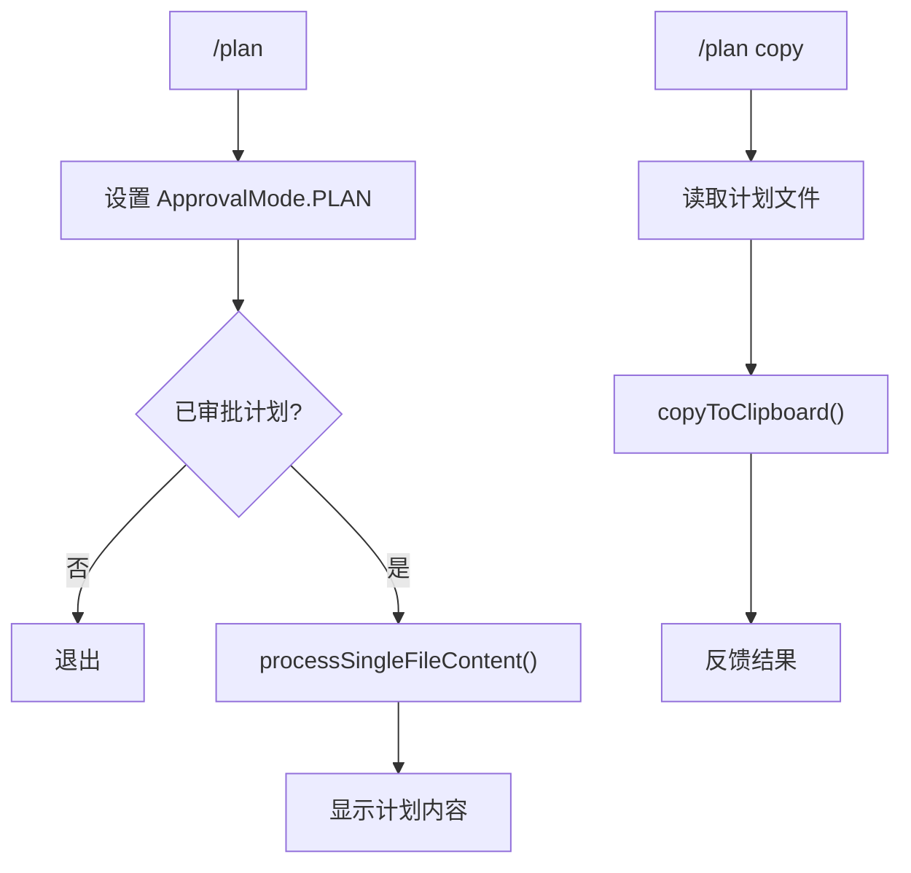

# planCommand.ts

> 切换到计划模式并查看/复制当前审批的计划

## 概述

`planCommand` 实现了 `/plan` 斜杠命令及 `copy` 子命令，用于将审批模式切换为 `PLAN`（计划模式），读取并展示当前已审批的计划文件内容，或将计划复制到剪贴板。

## 架构图（mermaid）

## 主要导出

| 导出名 | 类型 | 说明 |
|--------|------|------|
| `planCommand` | `SlashCommand` | `/plan` 命令，非自动执行 |

## 核心逻辑

1. **plan**（默认）：将 `ApprovalMode` 切换为 `PLAN`；如果之前不是计划模式则通知用户；如果存在已审批的计划路径，读取并展示其内容。
2. **copy 子命令**：获取审批计划路径，使用 `readFileWithEncoding()` 读取内容，调用 `copyToClipboard()` 复制到剪贴板。
3. 使用 `coreEvents.emitFeedback()` 进行消息反馈，而非直接调用 `context.ui.addItem()`。

## 内部依赖

| 模块 | 用途 |
|------|------|
| `./types.js` | `CommandContext`、`CommandKind`、`SlashCommand` |
| `../types.js` | `MessageType` |
| `../utils/commandUtils.js` | `copyToClipboard` |

## 外部依赖

| 包 | 用途 |
|----|------|
| `node:path` | 路径处理 |
| `@google/gemini-cli-core` | `ApprovalMode`、`coreEvents`、`debugLogger`、`processSingleFileContent`、`partToString`、`readFileWithEncoding` |
