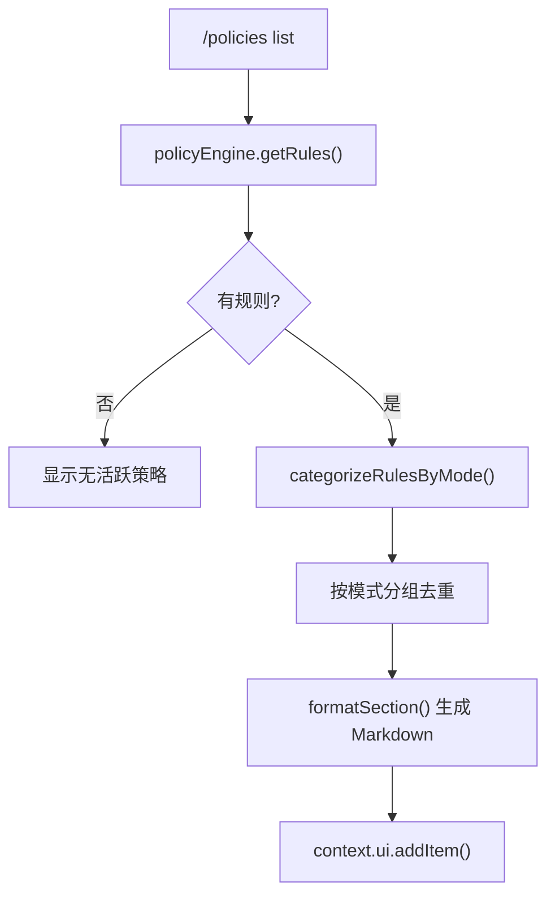

# policiesCommand.ts

> 查看按审批模式分组的活跃策略规则

## 概述

`policiesCommand` 实现了 `/policies` 斜杠命令及 `list` 子命令，从策略引擎获取所有规则并按审批模式（Normal、Auto Edit、Yolo、Plan）分类展示，以 Markdown 格式呈现每条规则的决策类型、工具名、参数模式、优先级和来源。

## 架构图（mermaid）

## 主要导出

| 导出名 | 类型 | 说明 |
|--------|------|------|
| `policiesCommand` | `SlashCommand` | `/policies` 顶层命令 |

## 核心逻辑

1. **categorizeRulesByMode()**：将每条规则按其 `modes` 字段归类到 `normal`、`autoEdit`、`yolo`、`plan` 四个数组中。无 `modes` 的规则视为适用于所有模式。
2. **去重逻辑**：Auto Edit、Yolo、Plan 模式的展示中排除已在 Normal 模式中出现的规则，避免重复。
3. **formatRule()**：格式化单条规则，显示序号、决策（ALLOW/DENY）、工具名、参数模式、优先级和来源。
4. **formatSection()**：生成带标题的 Markdown 章节，无规则时显示 `_No policies._`。

## 内部依赖

| 模块 | 用途 |
|------|------|
| `./types.js` | `CommandKind`、`SlashCommand` |
| `../types.js` | `MessageType` |

## 外部依赖

| 包 | 用途 |
|----|------|
| `@google/gemini-cli-core` | `ApprovalMode`、`PolicyRule` |
