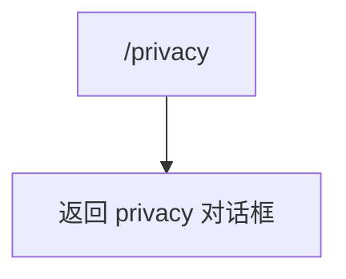

# privacyCommand.ts

> 显示隐私声明对话框

## 概述

`privacyCommand` 实现了 `/privacy` 斜杠命令，打开隐私声明对话框。

## 架构图（mermaid）

## 主要导出

| 导出名 | 类型 | 说明 |
|--------|------|------|
| `privacyCommand` | `SlashCommand` | `/privacy` 命令，自动执行 |

## 核心逻辑

直接返回 `OpenDialogActionReturn`，指定打开 `privacy` 对话框。

## 内部依赖

| 模块 | 用途 |
|------|------|
| `./types.js` | `CommandKind`、`OpenDialogActionReturn`、`SlashCommand` |

## 外部依赖

无
