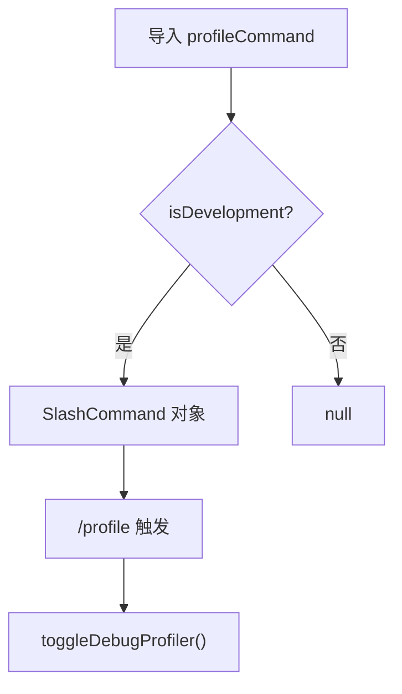

# profileCommand.ts

> 切换调试性能分析显示（仅开发模式可用）

## 概述

`profileCommand` 是一个条件导出的命令，仅在开发环境（`isDevelopment` 为 `true`）下可用。实现了 `/profile` 斜杠命令，切换调试性能分析器的显示状态。在非开发环境下导出为 `null`。

## 架构图（mermaid）

## 主要导出

| 导出名 | 类型 | 说明 |
|--------|------|------|
| `profileCommand` | `SlashCommand \| null` | 开发模式下的 `/profile` 命令 |

## 核心逻辑

1. 通过 `isDevelopment` 判断当前是否为开发环境。
2. 开发模式下调用 `context.ui.toggleDebugProfiler()` 切换分析器显示。

## 内部依赖

| 模块 | 用途 |
|------|------|
| `../../utils/installationInfo.js` | `isDevelopment` |
| `./types.js` | `CommandKind`、`SlashCommand` |

## 外部依赖

无
