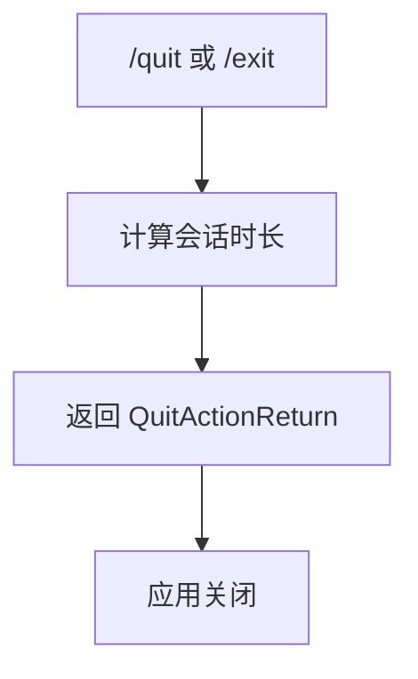

# quitCommand.ts

> 退出 CLI 应用

## 概述

`quitCommand` 实现了 `/quit` 斜杠命令（别名 `/exit`），计算会话持续时间并返回退出动作，触发应用关闭流程。

## 架构图（mermaid）

## 主要导出

| 导出名 | 类型 | 说明 |
|--------|------|------|
| `quitCommand` | `SlashCommand` | `/quit` 命令（别名 `exit`），自动执行 |

## 核心逻辑

1. 获取当前时间与 `sessionStartTime` 的差值计算会话壁钟时长。
2. 使用 `formatDuration()` 格式化时长。
3. 返回 `QuitActionReturn`，包含两条历史消息：用户输入的 `/quit` 和带有时长的退出消息。

## 内部依赖

| 模块 | 用途 |
|------|------|
| `../utils/formatters.js` | `formatDuration` |
| `./types.js` | `CommandKind`、`SlashCommand` |

## 外部依赖

无
