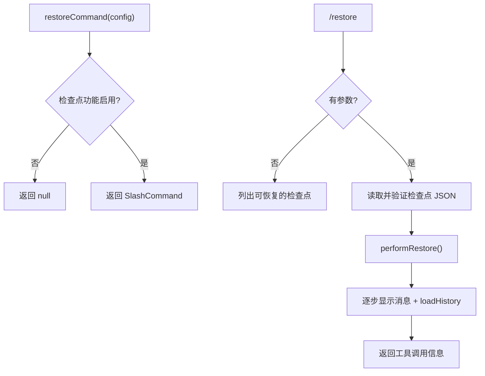

# restoreCommand.ts

> 恢复工具调用检查点，将对话和文件状态回退到特定时间点

## 概述

`restoreCommand` 是一个工厂函数，仅在启用了检查点功能时返回 `/restore` 斜杠命令。该命令可列出可恢复的工具调用检查点，或根据指定文件名恢复到该检查点的对话历史和文件状态。

## 架构图（mermaid）

## 主要导出

| 导出名 | 类型 | 说明 |
|--------|------|------|
| `restoreCommand` | `(config: Config \| null) => SlashCommand \| null` | 工厂函数 |

## 核心逻辑

1. **工厂函数**：检查 `config.getCheckpointingEnabled()`，禁用时返回 `null`。
2. **无参数**：读取项目临时检查点目录中的 JSON 文件列表，通过 `formatCheckpointDisplayList()` 格式化展示。
3. **有参数**：
   - 读取指定的检查点 JSON 文件。
   - 使用 Zod schema（`ToolCallDataSchema`）验证文件结构。
   - 调用 `performRestore()` 获取异步操作流。
   - 逐步处理操作：`message` 类型添加 UI 消息，`load_history` 类型恢复 UI 和客户端历史。
   - 最终返回 `tool` 类型的动作，包含原始工具调用的名称和参数。
4. **补全**：列出检查点目录中的 JSON 文件名（截断后缀）。

## 内部依赖

| 模块 | 用途 |
|------|------|
| `./types.js` | `CommandContext`、`SlashCommand`、`SlashCommandActionReturn`、`CommandKind` |
| `../types.js` | `HistoryItem` |

## 外部依赖

| 包 | 用途 |
|----|------|
| `node:fs/promises` | 文件读写 |
| `node:path` | 路径拼接 |
| `zod` | 数据验证 |
| `@google/gemini-cli-core` | `Config`、`formatCheckpointDisplayList`、`getToolCallDataSchema`、`getTruncatedCheckpointNames`、`performRestore`、`ToolCallData` |
