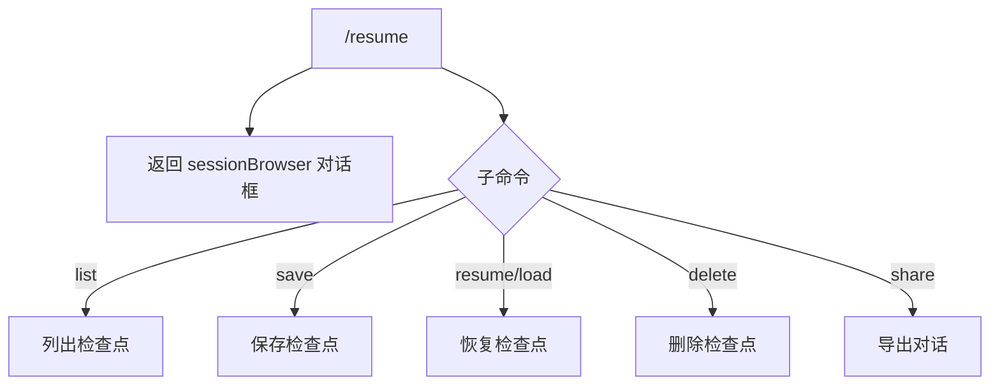

# resumeCommand.ts

> 浏览自动保存的对话并管理聊天检查点

## 概述

`resumeCommand` 实现了 `/resume` 斜杠命令，默认打开会话浏览器对话框，并复用 `chatCommand` 中导出的 `chatResumeSubCommands` 作为子命令集（包含 `list`、`save`、`resume`、`delete`、`share` 等检查点操作）。

## 架构图（mermaid）

## 主要导出

| 导出名 | 类型 | 说明 |
|--------|------|------|
| `resumeCommand` | `SlashCommand` | `/resume` 命令，自动执行 |

## 核心逻辑

1. 默认 action 返回 `sessionBrowser` 对话框，让用户浏览自动保存的对话。
2. 子命令集来自 `chatCommand.ts` 的 `chatResumeSubCommands`（详见 chatCommand 文档）。

## 内部依赖

| 模块 | 用途 |
|------|------|
| `./types.js` | `OpenDialogActionReturn`、`CommandContext`、`SlashCommand`、`CommandKind` |
| `./chatCommand.js` | `chatResumeSubCommands` |

## 外部依赖

无
