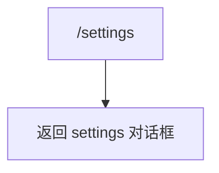

# settingsCommand.ts

> 打开设置对话框查看和编辑 Gemini CLI 配置

## 概述

`settingsCommand` 实现了 `/settings` 斜杠命令，打开设置管理对话框。标记为并发安全，可在 Agent 运行时使用。

## 架构图（mermaid）

## 主要导出

| 导出名 | 类型 | 说明 |
|--------|------|------|
| `settingsCommand` | `SlashCommand` | `/settings` 命令，自动执行，并发安全 |

## 核心逻辑

直接返回 `OpenDialogActionReturn`，指定打开 `settings` 对话框。

## 内部依赖

| 模块 | 用途 |
|------|------|
| `./types.js` | `CommandKind`、`OpenDialogActionReturn`、`SlashCommand` |

## 外部依赖

无
