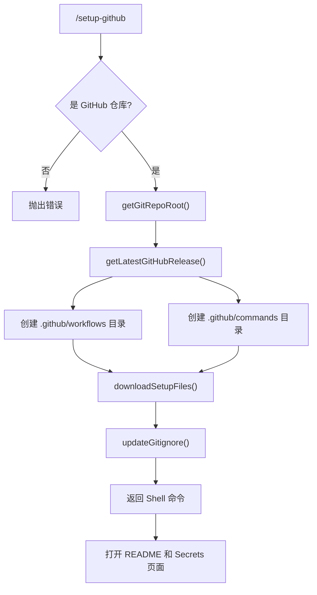

# setupGithubCommand.ts

> 设置 GitHub Actions 工作流以支持 Gemini CLI 自动化

## 概述

`setupGithubCommand` 实现了 `/setup-github` 斜杠命令，在 GitHub 仓库中自动下载和安装 Gemini CLI 相关的 GitHub Actions 工作流和命令配置文件。包括工作流模板、命令 TOML 文件、`.gitignore` 更新，以及在浏览器中打开设置页面的引导。

## 架构图（mermaid）

## 主要导出

| 导出名 | 类型 | 说明 |
|--------|------|------|
| `setupGithubCommand` | `SlashCommand` | `/setup-github` 命令，自动执行 |
| `GITHUB_WORKFLOW_PATHS` | `string[]` | 工作流文件路径列表 |
| `GITHUB_COMMANDS_PATHS` | `string[]` | 命令配置文件路径列表 |
| `updateGitignore` | `(gitRepoRoot: string) => Promise<void>` | 更新 `.gitignore` 的辅助函数 |

## 核心逻辑

1. 验证当前目录是 GitHub 仓库（`isGitHubRepository()`），获取 Git 根目录。
2. 获取 `google-github-actions/run-gemini-cli` 仓库的最新 release tag。
3. 从 `raw.githubusercontent.com` 下载 6 个工作流 YAML 文件和 5 个命令 TOML 文件。
4. `downloadFiles()` 支持代理配置和超时控制（30 秒），使用 `AbortController` 管理生命周期。
5. `updateGitignore()` 智能地向 `.gitignore` 添加 `.gemini/` 和 `gha-creds-*.json`，避免重复。
6. 最终返回 `run_shell_command` 工具调用，在 Shell 中输出成功消息并打开相关 URL。

## 内部依赖

| 模块 | 用途 |
|------|------|
| `./types.js` | `CommandContext`、`SlashCommand`、`SlashCommandActionReturn`、`CommandKind` |
| `../../utils/gitUtils.js` | `getGitRepoRoot`、`getLatestGitHubRelease`、`isGitHubRepository`、`getGitHubRepoInfo` |
| `../../ui/utils/commandUtils.js` | `getUrlOpenCommand` |

## 外部依赖

| 包 | 用途 |
|----|------|
| `node:path` / `node:fs` / `node:stream` | 文件系统操作 |
| `undici` | `ProxyAgent`（HTTP 代理支持） |
| `@google/gemini-cli-core` | `debugLogger` |
