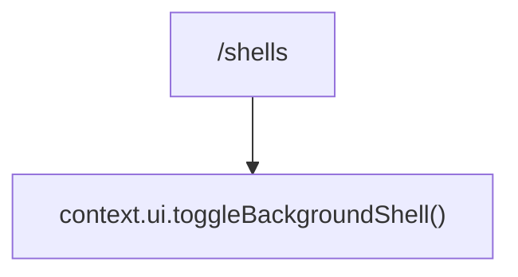

# shellsCommand.ts

> 切换后台 Shell 视图的显示

## 概述

`shellsCommand` 实现了 `/shells` 斜杠命令（别名 `bashes`），切换后台 Shell 面板的可见性。

## 架构图（mermaid）

## 主要导出

| 导出名 | 类型 | 说明 |
|--------|------|------|
| `shellsCommand` | `SlashCommand` | `/shells` 命令（别名 `bashes`），自动执行 |

## 核心逻辑

调用 `context.ui.toggleBackgroundShell()` 切换后台 Shell 面板的显示/隐藏状态。

## 内部依赖

| 模块 | 用途 |
|------|------|
| `./types.js` | `CommandKind`、`SlashCommand` |

## 外部依赖

无
