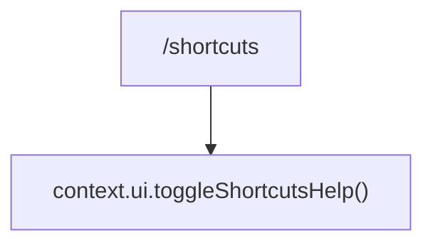

# shortcutsCommand.ts

> 切换输入框上方的快捷键面板显示

## 概述

`shortcutsCommand` 实现了 `/shortcuts` 斜杠命令，切换输入框上方快捷键帮助面板的可见性。

## 架构图（mermaid）

## 主要导出

| 导出名 | 类型 | 说明 |
|--------|------|------|
| `shortcutsCommand` | `SlashCommand` | `/shortcuts` 命令，自动执行 |

## 核心逻辑

调用 `context.ui.toggleShortcutsHelp()` 切换快捷键帮助面板的显示/隐藏状态。

## 内部依赖

| 模块 | 用途 |
|------|------|
| `./types.js` | `CommandKind`、`SlashCommand` |

## 外部依赖

无
