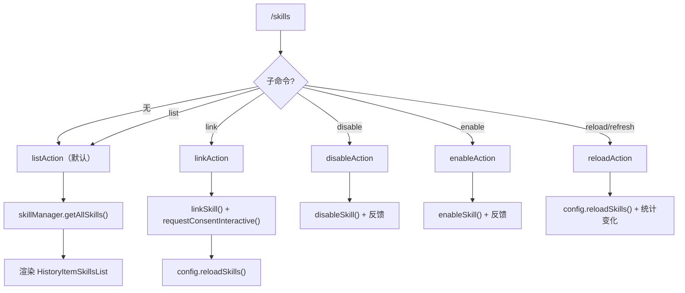

# skillsCommand.ts

> 管理 Agent 技能的列表、链接、启用、禁用和重载

## 概述

`skillsCommand` 实现了 `/skills` 斜杠命令及其子命令（`list`、`link`、`disable`、`enable`、`reload`/`refresh`），提供完整的 Agent 技能生命周期管理。支持从本地路径链接技能、按名称启用/禁用、重载技能发现，以及带描述和内置技能的列表展示。

## 架构图（mermaid）

## 主要导出

| 导出名 | 类型 | 说明 |
|--------|------|------|
| `skillsCommand` | `SlashCommand` | `/skills` 顶层命令，默认执行 `list` |

## 核心逻辑

1. **list**：支持 `nodesc` 隐藏描述、`all` 显示内置技能。从 `skillManager.getAllSkills()` 获取技能列表并渲染。
2. **link**：解析源路径和可选的 `--scope` 参数（`user`/`workspace`），调用 `linkSkill()` 处理链接。链接前通过 `requestConsentInteractive()` 获取用户同意。成功后重载技能。
3. **disable**：校验技能存在性和管理员权限（`isAdminEnabled()`），调用 `disableSkill()` 更新设置，提示用户运行 `/skills reload`。
4. **enable**：校验管理员权限，调用 `enableSkill()` 更新设置，提示用户运行 `/skills reload`。
5. **reload**：调用 `config.reloadSkills()`，统计新增和移除的技能数量。使用 100ms 延时的 `pendingItem` 避免快速操作的 UI 闪烁，确保至少显示 500ms。
6. 补全函数 `disableCompletion` 和 `enableCompletion` 分别过滤未禁用/已禁用的技能名称。

## 内部依赖

| 模块 | 用途 |
|------|------|
| `./types.js` | `CommandContext`、`SlashCommand`、`SlashCommandActionReturn`、`CommandKind` |
| `../types.js` | `HistoryItemInfo`、`HistoryItemSkillsList`、`MessageType` |
| `../../utils/skillSettings.js` | `disableSkill`、`enableSkill` |
| `../../utils/skillUtils.js` | `linkSkill`、`renderSkillActionFeedback` |
| `../../config/settings.js` | `SettingScope` |
| `../../config/extensions/consent.js` | `requestConsentInteractive`、`skillsConsentString` |

## 外部依赖

| 包 | 用途 |
|----|------|
| `@google/gemini-cli-core` | `getAdminErrorMessage`、`getErrorMessage` |
