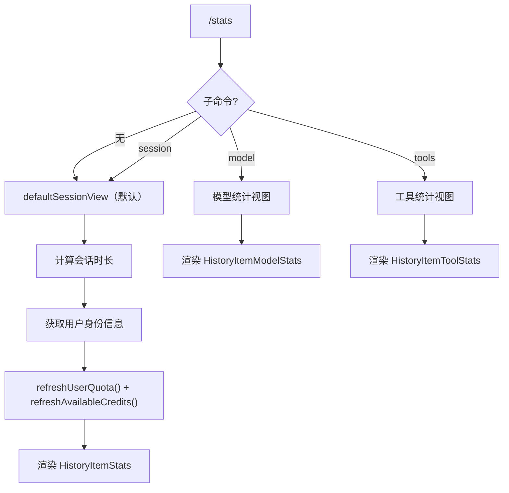

# statsCommand.ts

> 查看会话统计、模型信息和工具使用情况

## 概述

`statsCommand` 实现了 `/stats` 斜杠命令（别名 `usage`）及其子命令（`session`、`model`、`tools`），提供多维度的使用统计信息。默认显示会话视图，包含时长、认证信息、用户层级、配额和额度余额。

## 架构图（mermaid）

## 主要导出

| 导出名 | 类型 | 说明 |
|--------|------|------|
| `statsCommand` | `SlashCommand` | `/stats` 命令（别名 `usage`），并发安全 |

## 核心逻辑

1. **getUserIdentity()**：提取认证类型、用户邮箱、层级名称和 G1 积分余额。
2. **session**（默认）：计算会话壁钟时长，并行刷新用户配额和可用额度，展示包含配额（`quotas`）、池化剩余/限制/重置时间的完整统计。
3. **model**：展示当前模型名称、认证信息、层级和池化配额状态。
4. **tools**：渲染 `HistoryItemToolStats`，由 UI 层负责展示工具使用计数。

## 内部依赖

| 模块 | 用途 |
|------|------|
| `../types.js` | `HistoryItemStats`、`HistoryItemModelStats`、`HistoryItemToolStats`、`MessageType` |
| `../utils/formatters.js` | `formatDuration` |
| `./types.js` | `CommandContext`、`SlashCommand`、`CommandKind` |

## 外部依赖

| 包 | 用途 |
|----|------|
| `@google/gemini-cli-core` | `UserAccountManager`、`getG1CreditBalance` |
