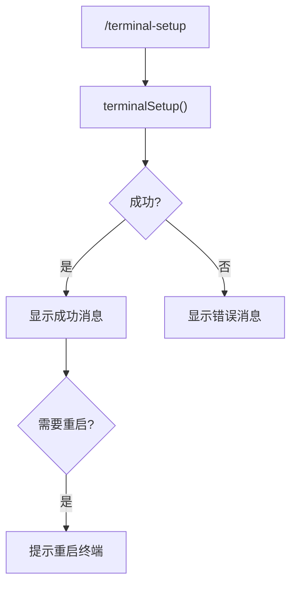

# terminalSetupCommand.ts

> 配置终端键位绑定以支持多行输入

## 概述

`terminalSetupCommand` 实现了 `/terminal-setup` 斜杠命令，自动检测并配置 VS Code、Cursor 和 Windsurf 的终端键位绑定，使其支持 Shift+Enter 和 Ctrl+Enter 的多行输入。

## 架构图（mermaid）

## 主要导出

| 导出名 | 类型 | 说明 |
|--------|------|------|
| `terminalSetupCommand` | `SlashCommand` | `/terminal-setup` 命令，自动执行 |

## 核心逻辑

1. 调用 `terminalSetup()` 异步函数执行实际的键位配置。
2. 根据返回结果的 `success` 字段决定消息类型（info/error）。
3. 如果 `requiresRestart` 为 `true`，追加重启提示信息。

## 内部依赖

| 模块 | 用途 |
|------|------|
| `./types.js` | `CommandKind`、`SlashCommand` |
| `../utils/terminalSetup.js` | `terminalSetup` |

## 外部依赖

| 包 | 用途 |
|----|------|
| `@google/gemini-cli-core` | `MessageActionReturn` |
