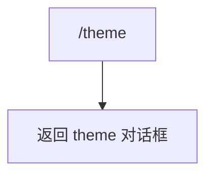

# themeCommand.ts

> 打开主题选择对话框

## 概述

`themeCommand` 实现了 `/theme` 斜杠命令，打开主题选择对话框供用户更改 CLI 界面主题。

## 架构图（mermaid）

## 主要导出

| 导出名 | 类型 | 说明 |
|--------|------|------|
| `themeCommand` | `SlashCommand` | `/theme` 命令，自动执行 |

## 核心逻辑

直接返回 `OpenDialogActionReturn`，指定打开 `theme` 对话框。

## 内部依赖

| 模块 | 用途 |
|------|------|
| `./types.js` | `CommandKind`、`OpenDialogActionReturn`、`SlashCommand` |

## 外部依赖

无
