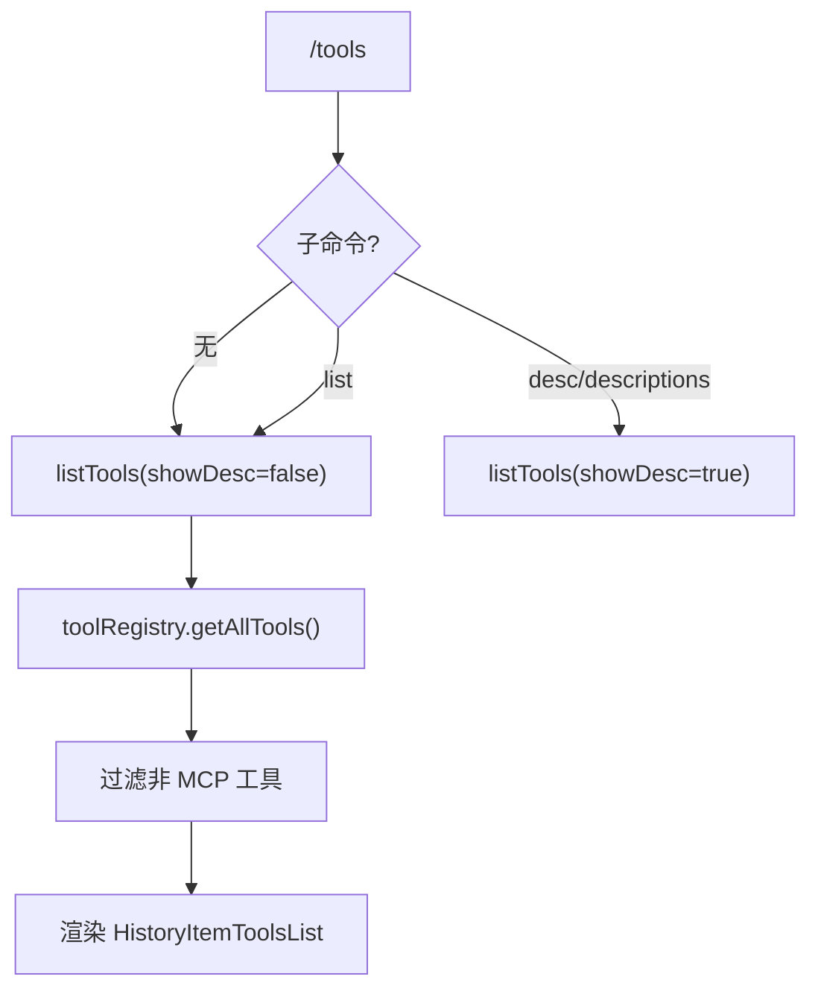

# toolsCommand.ts

> 列出可用的 Gemini CLI 工具（排除 MCP 工具）

## 概述

`toolsCommand` 实现了 `/tools` 斜杠命令及其子命令（`list`、`desc`/`descriptions`），从工具注册表获取所有非 MCP 工具并展示。`list` 仅显示工具名，`desc` 额外显示工具描述。

## 架构图（mermaid）

## 主要导出

| 导出名 | 类型 | 说明 |
|--------|------|------|
| `toolsCommand` | `SlashCommand` | `/tools` 顶层命令 |

## 核心逻辑

1. `listTools()` 共享函数获取 `toolRegistry.getAllTools()`，通过检查工具对象是否有 `serverName` 属性来过滤掉 MCP 工具。
2. 构建 `HistoryItemToolsList`，包含每个工具的 `name`、`displayName`、`description`。
3. `showDescriptions` 参数控制是否在 UI 中展示描述。
4. 默认 action 保持向后兼容，也能解析 `desc`/`descriptions` 字符串参数。

## 内部依赖

| 模块 | 用途 |
|------|------|
| `./types.js` | `CommandContext`、`SlashCommand`、`CommandKind` |
| `../types.js` | `MessageType`、`HistoryItemToolsList` |

## 外部依赖

无
