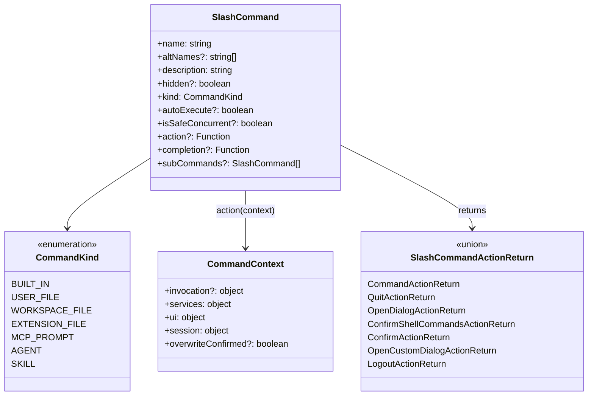

# types.ts

> 定义斜杠命令系统的核心类型接口和枚举

## 概述

`types.ts` 是整个斜杠命令子系统的类型基础文件。它定义了 `CommandContext`（命令上下文）、`SlashCommand`（斜杠命令接口）、`CommandKind`（命令种类枚举）以及各种命令动作返回类型。所有命令处理器都依赖此文件中的类型定义。

## 架构图（mermaid）

## 主要导出

| 导出名 | 类型 | 说明 |
|--------|------|------|
| `CommandContext` | interface | 命令执行时的完整上下文，包含服务、UI、会话等 |
| `SlashCommand` | interface | 斜杠命令的标准化契约接口 |
| `CommandKind` | enum | 命令来源种类（内置、用户文件、扩展等） |
| `SlashCommandActionReturn` | type | 命令动作返回值的联合类型 |
| `QuitActionReturn` | interface | 退出应用的返回类型 |
| `OpenDialogActionReturn` | interface | 打开对话框的返回类型 |
| `ConfirmShellCommandsActionReturn` | interface | 确认 Shell 命令执行的返回类型 |
| `ConfirmActionReturn` | interface | 通用确认操作的返回类型 |
| `OpenCustomDialogActionReturn` | interface | 打开自定义对话框的返回类型 |
| `LogoutActionReturn` | interface | 登出操作的返回类型 |

## 核心逻辑

1. **CommandContext** 将命令执行所需的所有依赖分为四组：`invocation`（调用信息）、`services`（Config、Settings、Git、Logger）、`ui`（历史管理、对话框控制、调试信息）、`session`（统计数据、会话级 Shell 白名单）。
2. **SlashCommand** 接口支持嵌套子命令（`subCommands`）、参数补全（`completion`）、并发安全标记（`isSafeConcurrent`）以及自动执行标记（`autoExecute`）。
3. **CommandKind** 枚举区分命令来源：`BUILT_IN`（内置）、`USER_FILE` / `WORKSPACE_FILE`（TOML 文件定义）、`EXTENSION_FILE`（扩展）、`MCP_PROMPT`（MCP 提示）、`AGENT`（代理）、`SKILL`（技能）。
4. **SlashCommandActionReturn** 是一个联合类型，允许命令返回多种动作：显示消息、退出应用、打开对话框、请求确认、显示自定义 React 组件或触发登出。

## 内部依赖

| 模块 | 用途 |
|------|------|
| `../types.js` | `HistoryItemWithoutId`、`HistoryItem`、`ConfirmationRequest` |
| `../hooks/useHistoryManager.js` | `UseHistoryManagerReturn` |
| `../contexts/SessionContext.js` | `SessionStatsState` |
| `../state/extensions.js` | `ExtensionUpdateAction`、`ExtensionUpdateStatus` |
| `../../config/settings.js` | `LoadedSettings` |

## 外部依赖

| 包 | 用途 |
|----|------|
| `react` | `ReactNode` 类型（用于自定义对话框组件） |
| `@google/gemini-cli-core` | `Config`、`GitService`、`Logger`、`CommandActionReturn`、`AgentDefinition` |
