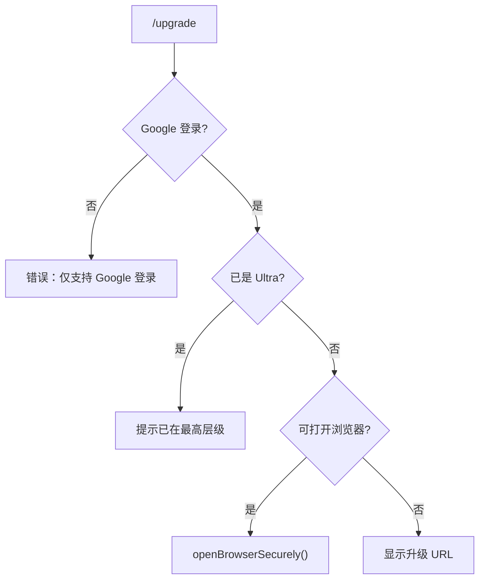

# upgradeCommand.ts

> 打开 Gemini Code Assist 层级升级页面

## 概述

`upgradeCommand` 实现了 `/upgrade` 斜杠命令，仅在使用 Google 登录认证时可用。检查用户是否已在最高层级（Ultra），未达到时在浏览器中打开升级页面。

## 架构图（mermaid）

## 主要导出

| 导出名 | 类型 | 说明 |
|--------|------|------|
| `upgradeCommand` | `SlashCommand` | `/upgrade` 命令，自动执行 |

## 核心逻辑

1. 检查认证类型是否为 `AuthType.LOGIN_WITH_GOOGLE`。
2. 通过 `isUltraTier()` 检查是否已在最高层级。
3. 通过 `shouldLaunchBrowser()` 检查是否可以打开浏览器。
4. 调用 `openBrowserSecurely(UPGRADE_URL_PAGE)` 安全地打开升级页面。

## 内部依赖

| 模块 | 用途 |
|------|------|
| `./types.js` | `CommandKind`、`SlashCommand` |
| `../../utils/tierUtils.js` | `isUltraTier` |

## 外部依赖

| 包 | 用途 |
|----|------|
| `@google/gemini-cli-core` | `AuthType`、`openBrowserSecurely`、`shouldLaunchBrowser`、`UPGRADE_URL_PAGE` |
