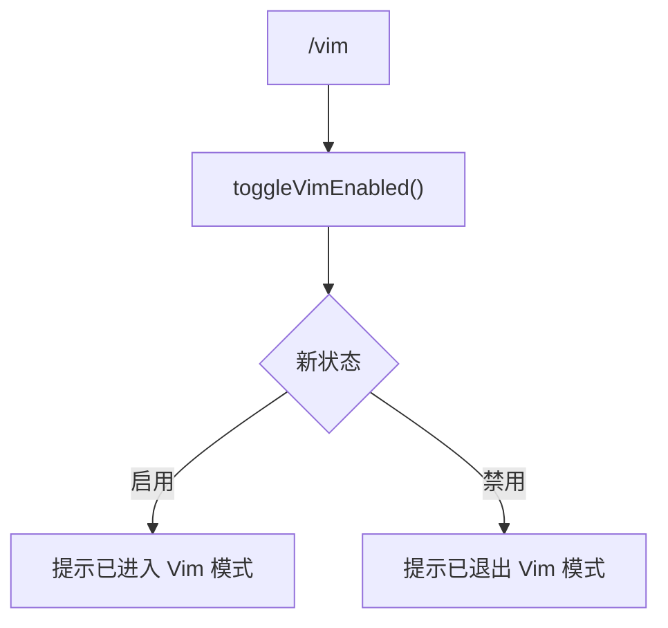

# vimCommand.ts

> 切换 Vim 编辑模式

## 概述

`vimCommand` 实现了 `/vim` 斜杠命令，切换输入框的 Vim 键绑定模式。标记为并发安全，可在 Agent 运行时使用。

## 架构图（mermaid）

## 主要导出

| 导出名 | 类型 | 说明 |
|--------|------|------|
| `vimCommand` | `SlashCommand` | `/vim` 命令，自动执行，并发安全 |

## 核心逻辑

1. 调用 `context.ui.toggleVimEnabled()` 异步切换 Vim 模式。
2. 根据返回的新状态布尔值显示相应的提示消息。

## 内部依赖

| 模块 | 用途 |
|------|------|
| `./types.js` | `CommandKind`、`SlashCommand` |

## 外部依赖

无
