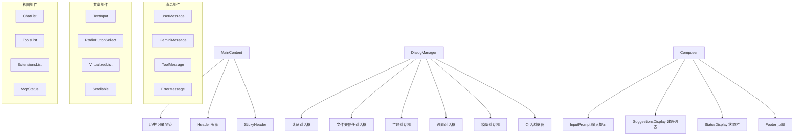

# components 架构

> UI 组件库，包含 Gemini CLI 所有可视化组件，从对话消息到设置对话框

## 概述

`components` 目录是 Gemini CLI 的组件库，包含 70+ 个 React 组件，负责终端界面的所有可视化呈现。组件按功能分为消息展示、共享基础组件、会话浏览器、分诊工具和视图列表等子目录，以及大量顶层业务组件。核心组件包括 MainContent（主内容区域）、Composer（输入器）、DialogManager（对话框管理）和 Footer（页脚信息栏）。

## 架构图



## 目录结构

```
components/
├── messages/               # 消息渲染组件
├── shared/                 # 共享基础组件
├── SessionBrowser/         # 会话浏览器子组件
├── triage/                 # 问题分诊组件
├── views/                  # 列表视图组件
├── MainContent.tsx         # 主内容区域
├── Composer.tsx             # 输入组合器
├── DialogManager.tsx        # 对话框管理器
├── Footer.tsx               # 页脚信息栏
├── Header.tsx               # 头部信息
├── AppHeader.tsx            # 应用头部
├── InputPrompt.tsx          # 输入提示
├── SuggestionsDisplay.tsx   # 建议列表
├── StatusDisplay.tsx        # 状态显示
├── LoadingIndicator.tsx     # 加载指示器
├── SessionBrowser.tsx       # 会话浏览器
├── SettingsDialog.tsx       # 设置对话框
├── ThemeDialog.tsx          # 主题对话框
├── ModelDialog.tsx          # 模型选择对话框
├── FolderTrustDialog.tsx    # 文件夹信任对话框
├── ToolConfirmationQueue.tsx # 工具确认队列
├── RewindViewer.tsx         # 回退查看器
├── Help.tsx                 # 帮助信息
├── AboutBox.tsx             # 关于信息
├── Tips.tsx                 # 提示信息
├── Banner.tsx               # 横幅
├── AsciiArt.ts              # ASCII 艺术字
├── ColorsDisplay.tsx        # 颜色展示
├── Notifications.tsx        # 通知区域
├── QuotaDisplay.tsx         # 配额显示
├── Table.tsx                # 表格组件
└── ... (更多业务组件)
```

## 关键文件

| 文件 | 功能 |
|------|------|
| `MainContent.tsx` | 主内容区域，渲染历史记录和 Sticky Header |
| `Composer.tsx` | 输入组合器，集成输入提示、建议、状态栏和页脚 |
| `DialogManager.tsx` | 对话框路由器，根据 UI 状态显示对应的对话框 |
| `InputPrompt.tsx` | 用户输入区域，处理文本输入、补全、历史记录 |
| `Footer.tsx` | 页脚，显示当前目录、模型、上下文使用率等信息 |
| `SessionBrowser.tsx` | 会话浏览器，支持搜索、排序、恢复和删除历史会话 |
| `SettingsDialog.tsx` | 设置对话框，多标签页配置编辑器 |
| `ToolConfirmationQueue.tsx` | 工具调用确认队列，处理需要用户批准的工具调用 |

## 内部依赖

- `../contexts/` - 各种 React Context
- `../hooks/` - 自定义 Hooks
- `../key/keyMatchers` - 键盘命令匹配
- `../colors` - 颜色定义
- `../semantic-colors` - 语义颜色
- `../types` - 核心类型
- `../constants` - 常量定义
- `../utils/` - UI 工具函数

## 外部依赖

| 包名 | 用途 |
|------|------|
| `ink` | Box、Text、Static 等核心终端 UI 组件 |
| `react` | 组件基础框架 |
| `ink-spinner` | 加载动画 |
| `@google/gemini-cli-core` | 核心类型和服务 |
