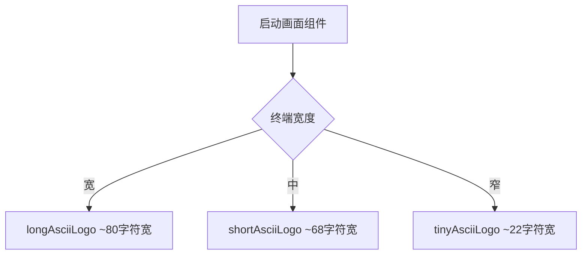

# AsciiArt.ts

> 定义 Gemini CLI 启动画面使用的三种尺寸 ASCII 艺术 Logo

## 概述

`AsciiArt.ts` 导出三个 ASCII 艺术字符串常量，分别是长版、短版和迷你版的 "GEMINI" Logo。根据终端宽度自动选择合适的尺寸展示在 CLI 启动画面上。

## 架构图（mermaid）

## 主要导出

| 名称 | 类型 | 说明 |
|------|------|------|
| `shortAsciiLogo` | `string` | 标准宽度的 "GEMINI" ASCII Logo |
| `longAsciiLogo` | `string` | 带 `>` 装饰前缀的加宽版 "GEMINI" ASCII Logo |
| `tinyAsciiLogo` | `string` | 仅含 `>G` 的迷你版 Logo，适用于窄终端 |

## 核心逻辑

纯数据定义文件。三个 Logo 均使用 Unicode 方块字符（`█`、`░`）构成的等宽字体艺术。

## 内部依赖

无

## 外部依赖

无
