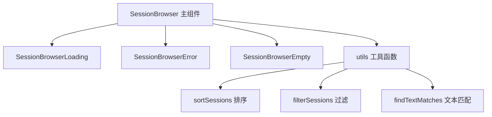

# SessionBrowser 架构

> 会话浏览器子组件，提供加载、错误和空状态的专用展示

## 概述

`SessionBrowser` 子目录包含会话浏览器的辅助组件和工具函数。主要的 `SessionBrowser` 组件位于父目录，这里的组件处理浏览器的各种边界状态（加载中、错误、空数据），以及会话的排序、过滤和文本匹配工具函数。

## 架构图



## 目录结构

```
SessionBrowser/
├── SessionBrowserLoading.tsx  # 加载中状态组件
├── SessionBrowserError.tsx    # 错误状态组件
├── SessionBrowserEmpty.tsx    # 空数据状态组件
└── utils.ts                   # 排序、过滤、文本匹配工具函数
```

## 关键文件

| 文件 | 功能 |
|------|------|
| `utils.ts` | 提供 sortSessions（按日期/消息数/名称排序）、filterSessions（搜索过滤）、findTextMatches（对话内容搜索匹配） |
| `SessionBrowserLoading.tsx` | 显示"Loading sessions..."的简单加载状态 |
| `SessionBrowserError.tsx` | 显示错误信息和退出提示 |
| `SessionBrowserEmpty.tsx` | 显示"No auto-saved conversations found."的空状态 |

## 内部依赖

- `../../colors` - 颜色定义
- `../SessionBrowser` - SessionBrowserState 类型
- `../../../utils/sessionUtils` - SessionInfo、TextMatch、cleanMessage 类型和工具

## 外部依赖

| 包名 | 用途 |
|------|------|
| `ink` | Box、Text 组件 |
| `react` | React.JSX.Element 类型 |
