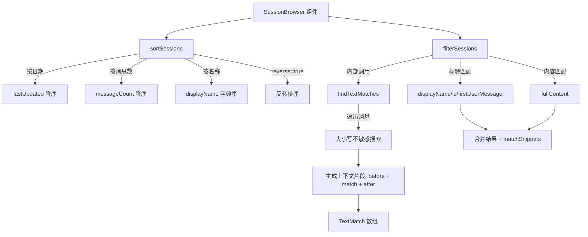

# utils.ts (SessionBrowser)

> 提供会话列表的排序、搜索文本匹配和过滤功能

## 概述

`utils.ts` 是会话浏览器（Session Browser）组件的工具函数模块，提供三个核心功能：会话排序、全文搜索匹配和会话过滤。它支持按日期/消息数/名称排序，并能在会话消息中执行带上下文的子字符串搜索。

## 架构图（mermaid）

## 主要导出

| 名称 | 类型 | 说明 |
|------|------|------|
| `sortSessions` | `function` | 按指定条件排序会话数组（不修改原数组） |
| `findTextMatches` | `function` | 在消息数组中搜索查询文本，返回带上下文的匹配结果 |
| `filterSessions` | `function` | 根据搜索查询过滤会话列表，同时填充匹配片段 |

## 核心逻辑

### sortSessions
- 支持三种排序维度：`'date'`（最后更新时间）、`'messages'`（消息数量）、`'name'`（显示名称）
- 默认降序排列，`reverse` 参数可翻转
- 返回新数组，不修改输入

### findTextMatches
- 大小写不敏感的子字符串搜索
- 对每个匹配生成上下文片段（前后各 10 个字符）
- 超出内容边界时添加 `...` 省略符
- 使用 `cleanMessage` 清洗消息内容后再搜索
- 返回包含 `before`、`match`、`after`、`role` 的 `TextMatch` 数组

### filterSessions
- 优先匹配标题（`displayName`、`id`、`firstUserMessage`）
- 然后匹配完整内容（`fullContent`）
- 对匹配的会话调用 `findTextMatches` 填充 `matchSnippets` 和 `matchCount`
- 无查询时返回所有会话（清除匹配信息）

## 内部依赖

| 模块 | 用途 |
|------|------|
| `../../../utils/sessionUtils.js` | `cleanMessage`, `SessionInfo`, `TextMatch` |

## 外部依赖

无
