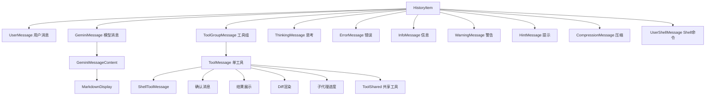

# messages 架构

> 消息渲染组件集合，处理对话中各类消息的终端展示

## 概述

`messages` 目录包含所有对话消息类型的渲染组件。Gemini CLI 的对话界面由多种消息类型组成：用户输入、模型响应、工具调用结果、思考过程、错误信息等。每种消息类型都有专门的组件负责渲染，确保在终端中以清晰、一致的方式展示信息。

## 架构图



## 目录结构

```
messages/
├── UserMessage.tsx             # 用户消息渲染
├── GeminiMessage.tsx           # 模型响应消息入口
├── GeminiMessageContent.tsx    # 模型响应内容渲染
├── ToolGroupMessage.tsx        # 工具调用组消息
├── ToolMessage.tsx             # 单个工具调用消息
├── ShellToolMessage.tsx        # Shell 命令工具消息
├── ToolConfirmationMessage.tsx # 工具确认消息
├── ToolResultDisplay.tsx       # 工具执行结果展示
├── ToolShared.tsx              # 工具消息共享逻辑
├── DiffRenderer.tsx            # Diff 差异渲染器
├── SubagentProgressDisplay.tsx # 子代理进度展示
├── ThinkingMessage.tsx         # AI 思考过程消息
├── ModelMessage.tsx            # 模型切换消息
├── ErrorMessage.tsx            # 错误消息
├── InfoMessage.tsx             # 信息消息
├── WarningMessage.tsx          # 警告消息
├── HintMessage.tsx             # 用户提示消息
├── UserShellMessage.tsx        # 用户 Shell 命令消息
├── CompressionMessage.tsx      # 上下文压缩消息
└── Todo.tsx                    # TODO 列表渲染
```

## 关键文件

| 文件 | 功能 |
|------|------|
| `GeminiMessage.tsx` | 模型响应消息入口，处理消息截断和 Markdown 渲染开关 |
| `GeminiMessageContent.tsx` | 模型响应内容的实际渲染，支持 Markdown 和原始文本 |
| `ToolGroupMessage.tsx` | 工具调用组渲染，显示多个工具的并行执行状态 |
| `ToolMessage.tsx` | 单个工具调用的完整渲染，包括状态图标、名称、结果 |
| `ShellToolMessage.tsx` | Shell 命令工具的特殊渲染，支持 PTY 输出和交互式 Shell |
| `DiffRenderer.tsx` | 文件差异渲染器，以终端友好的方式显示代码变更 |
| `ToolShared.tsx` | 工具消息共享的格式化逻辑和状态映射 |
| `ToolResultDisplay.tsx` | 工具执行结果的统一展示组件 |

## 内部依赖

- `../shared/` - MaxSizedBox、SlicingMaxSizedBox、ExpandableText 等共享组件
- `../../utils/MarkdownDisplay` - Markdown 渲染
- `../../utils/highlight` - 语法高亮
- `../../utils/toolLayoutUtils` - 工具布局工具
- `../../contexts/UIStateContext` - UI 状态
- `../../contexts/ToolActionsContext` - 工具操作
- `../../hooks/useKeypress` - 键盘事件
- `../../colors` - 颜色
- `../../semantic-colors` - 语义颜色
- `../../types` - ToolCallStatus 等类型
- `../../constants` - 工具状态符号

## 外部依赖

| 包名 | 用途 |
|------|------|
| `ink` | Box、Text 终端组件 |
| `react` | 组件框架 |
| `@google/gemini-cli-core` | CoreToolCallStatus、ToolResultDisplay 等核心类型 |
