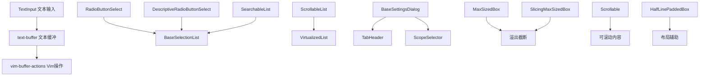

# shared 架构

> 共享基础 UI 组件库，提供可复用的终端交互原语和布局组件

## 概述

`shared` 目录包含 Gemini CLI 中跨多个功能模块共享的基础 UI 组件。这些组件提供了终端 UI 的构建基元：文本输入、单选按钮、列表滚动、虚拟化列表、对话框布局等。它们是 Gemini CLI 所有复杂 UI 的基石，确保交互体验的一致性。

## 架构图



## 目录结构

```
shared/
├── text-buffer.ts                    # 文本缓冲区管理（光标、选择、撤销/重做）
├── vim-buffer-actions.ts             # Vim 模式下的缓冲区操作
├── TextInput.tsx                     # 文本输入组件
├── RadioButtonSelect.tsx             # 单选按钮选择列表
├── DescriptiveRadioButtonSelect.tsx  # 带描述的单选列表
├── BaseSelectionList.tsx             # 基础选择列表
├── SearchableList.tsx                # 可搜索列表
├── ScrollableList.tsx                # 可滚动列表
├── VirtualizedList.tsx               # 虚拟化长列表
├── Scrollable.tsx                    # 可滚动容器
├── BaseSettingsDialog.tsx            # 基础设置对话框
├── TabHeader.tsx                     # 标签头部
├── ScopeSelector.tsx                 # 作用域选择器
├── SectionHeader.tsx                 # 分区头部
├── DialogFooter.tsx                  # 对话框底部
├── MaxSizedBox.tsx                   # 最大尺寸盒子（溢出截断）
├── SlicingMaxSizedBox.tsx            # 切片式最大尺寸盒子
├── HalfLinePaddedBox.tsx             # 半行填充盒子
├── EnumSelector.tsx                  # 枚举选择器
├── HorizontalLine.tsx                # 水平分隔线
└── ExpandableText.tsx                # 可展开文本
```

## 关键文件

| 文件 | 功能 |
|------|------|
| `text-buffer.ts` | 核心文本缓冲区 Hook，管理光标位置、文本选择、撤销/重做栈、粘贴处理、视口滚动 |
| `vim-buffer-actions.ts` | Vim 模式操作集成，支持 Normal/Insert/Visual 模式的缓冲区操作 |
| `TextInput.tsx` | 文本输入组件，渲染缓冲区内容，处理光标显示和占位符 |
| `RadioButtonSelect.tsx` | 通用单选按钮列表，支持键盘导航和数字快捷选择 |
| `BaseSelectionList.tsx` | 基础选择列表，提供键盘导航、高亮和选择功能 |
| `VirtualizedList.tsx` | 虚拟化列表，只渲染可见区域的条目以提升性能 |
| `Scrollable.tsx` | 可滚动容器，支持键盘和鼠标滚动 |
| `BaseSettingsDialog.tsx` | 多标签页设置对话框基础组件 |
| `MaxSizedBox.tsx` | 最大尺寸盒子，超出部分截断并显示展开提示 |

## 内部依赖

- `../../hooks/useKeypress` - 键盘事件
- `../../hooks/useKeyMatchers` - 键绑定匹配
- `../../hooks/useSelectionList` - 列表选择逻辑
- `../../hooks/useMouse` - 鼠标事件
- `../../key/keyMatchers` - Command 枚举
- `../../contexts/OverflowContext` - 溢出状态管理
- `../../colors` - 颜色
- `../../semantic-colors` - 语义颜色

## 外部依赖

| 包名 | 用途 |
|------|------|
| `ink` | Box、Text 组件，useStdin |
| `react` | useState、useEffect、useRef、useCallback、useMemo |
| `@google/gemini-cli-core` | EditorType 等核心类型 |
