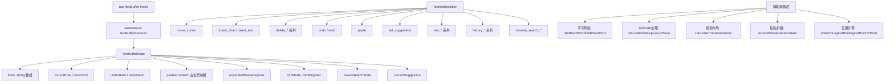
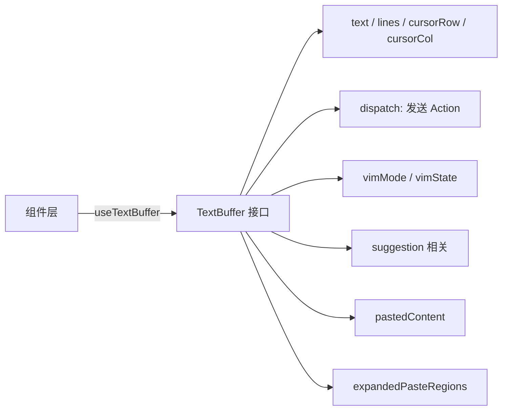

# text-buffer.ts

> 实现完整的终端文本编辑缓冲区，包含光标管理、撤销/重做、多行编辑、粘贴折叠、Vim 集成和视觉布局计算

## 概述

`text-buffer.ts` 是 Gemini CLI 中最大的单文件模块（约 4180 行），实现了一个功能完备的终端文本编辑器缓冲区。它提供了基于 React useReducer 的状态管理，支持多行文本编辑、Unicode 感知的光标移动（含 CJK 宽字符、组合标记、emoji）、词级导航（含跨行和跨脚本检测）、撤销/重做栈、大段粘贴折叠为占位符、文件路径图片预览转换、历史命令导航、反向搜索、自动补全建议、Vim 模式集成，以及考虑行折叠的视觉布局计算。

## 架构图（mermaid）

## 主要导出

### 常量

| 名称 | 说明 |
|------|------|
| `LARGE_PASTE_LINE_THRESHOLD` | 大段粘贴行数阈值（5 行） |
| `LARGE_PASTE_CHAR_THRESHOLD` | 大段粘贴字符数阈值（500 字符） |
| `PASTED_TEXT_PLACEHOLDER_REGEX` | 粘贴占位符正则 |
| `imagePathRegex` | 图片路径正则（png/jpg/gif/webp/svg） |

### 类型

| 名称 | 说明 |
|------|------|
| `Direction` | 光标移动方向联合类型 |
| `TextBufferState` | 缓冲区完整状态接口 |
| `TextBufferAction` | 40+ 种 Action 的联合类型 |
| `TextBufferOptions` | Hook 配置选项 |
| `TextBuffer` | Hook 返回的公共 API 接口 |
| `Viewport` | 视口信息接口 |
| `VisualLayout` | 视觉布局计算结果 |
| `Transformation` | 行内文本转换信息 |
| `ExpandedPasteInfo` | 展开的粘贴区域信息 |

### 核心函数

| 名称 | 说明 |
|------|------|
| `useTextBuffer` | 主 Hook，返回 `TextBuffer` 接口 |
| `textBufferReducer` | Reducer 函数，处理所有 Action |
| `expandPastePlaceholders` | 将粘贴占位符替换为实际内容 |
| `isWordCharStrict` / `isWhitespace` / `isCombiningMark` | 字符分类函数 |
| `getCharScript` / `isDifferentScript` | 脚本检测（Latin/Han/Arabic 等） |
| `findNextWordStartInLine` / `findPrevWordStartInLine` | 行内词级导航 |
| `findNextWordAcrossLines` / `findPrevWordAcrossLines` | 跨行词级导航 |
| `findNextBigWordAcrossLines` / `findPrevBigWordAcrossLines` | 大词级导航（Vim W/B） |
| `findWordEndInLine` / `findBigWordEndInLine` | 词尾查找 |
| `offsetToLogicalPos` / `logicalPosToOffset` | 偏移量与逻辑位置互转 |
| `getPositionFromOffsets` / `getLineRangeOffsets` | 范围计算 |
| `replaceRangeInternal` | 内部范围替换 |
| `pushUndo` | 压入撤销栈 |
| `calculateTransformations` / `calculateTransformationsForLine` | 行内文本转换计算（图片路径、粘贴占位符） |
| `calculateTransformedLine` | 应用转换后的行文本 |
| `getTransformUnderCursor` | 获取光标处的转换信息 |
| `detachExpandedPaste` | 分离展开的粘贴区域 |
| `shiftExpandedRegions` | 调整展开区域偏移 |
| `getExpandedPasteAtLine` | 获取指定行的展开粘贴信息 |
| `getTransformedImagePath` | 路径标准化 |

## 核心逻辑

### 文本编辑
- 基于行数组（`lines: string[]`）的多行文本模型
- 使用 Unicode Code Point 感知的操作（`toCodePoints`/`cpLen`/`cpSlice`）确保正确处理 emoji、CJK、组合字符
- 插入/删除操作自动管理撤销栈
- 支持行级和字符级的范围替换

### 词级导航
- 跨脚本检测（Latin/Han/Arabic/Cyrillic 等），不同脚本间视为词边界
- 组合标记（如重音符号）不断词
- Vim 兼容的 Big Word 导航（仅以空白分词）
- 跨行导航支持

### 粘贴处理
- 大段粘贴（>5 行或 >500 字符）折叠为 `[Pasted Text: N lines]` 占位符
- 可通过 Ctrl+O 展开/折叠
- 提交时自动展开所有占位符
- 文件路径粘贴检测和转换

### 视觉布局
- 考虑图片路径转换、粘贴占位符等变换后的实际显示内容
- 精确计算变换区域的显示范围

### Vim 集成
- 维护 Vim 模式状态（Normal/Insert/Command）
- Vim Action 委托给 `vim-buffer-actions.ts` 处理
- 支持 Vim 寄存器

## 内部依赖

| 模块 | 用途 |
|------|------|
| `./vim-buffer-actions.js` | Vim 操作处理 |
| `../../utils/textUtils.js` | Unicode 文本工具 |
| `../../utils/clipboardUtils.js` | 粘贴路径解析 |
| `../../utils/editorUtils.js` | 外部编辑器打开 |
| `../../contexts/KeypressContext.js` → `Key` | 按键类型 |
| `../../key/keyMatchers.js` → `Command` | 命令枚举 |
| `../../hooks/useKeyMatchers.js` | 键匹配器 Hook |
| `../../constants.js` | LRU 缓存限制 |

## 外部依赖

| 模块 | 用途 |
|------|------|
| `react` | `useState`, `useCallback`, `useEffect`, `useMemo`, `useReducer` |
| `mnemonist` | `LRUCache` 高性能 LRU 缓存 |
| `@google/gemini-cli-core` | `coreEvents`, `debugLogger`, `unescapePath`, `EditorType` |
| `node:fs` / `node:os` / `node:path` | 文件系统、路径操作 |
