# vim-buffer-actions.ts

> 实现 Vim 模式下所有文本操作的处理逻辑，包括移动、删除、修改、复制和粘贴

## 概述

`vim-buffer-actions.ts` 是 Vim 模式文本操作的实现核心（约 1849 行）。它定义了 `VimAction` 类型（从 `TextBufferAction` 中提取的 50+ 种 Vim 专属操作）和 `handleVimAction` 函数（一个大型分发函数，处理每种 Vim 操作对文本缓冲区状态的影响）。涵盖了 Vim Normal 模式下的字符移动、词级移动、行级操作、删除、修改（进入 Insert 模式）、字符查找、大小写切换、行复制和粘贴等功能。

## 架构图（mermaid）

```mermaid
graph TD
    A[text-buffer.ts Reducer] -->|vim_* Action| B[handleVimAction]
    B --> C{Action 类型分发}

    C --> D[移动类]
    D --> D1[vim_move_left/right/up/down]
    D --> D2[vim_move_word_forward/backward/end]
    D --> D3[vim_move_big_word_forward/backward/end]
    D --> D4[vim_move_to_line_start/end]
    D --> D5[vim_move_to_first_nonwhitespace]
    D --> D6[vim_move_to_first_line/last_line/line]

    C --> E[删除类]
    E --> E1[vim_delete_char/char_before]
    E --> E2[vim_delete_word_forward/backward/end]
    E --> E3[vim_delete_big_word_forward/backward/end]
    E --> E4[vim_delete_line]
    E --> E5[vim_delete_to_end/start_of_line]
    E --> E6[vim_delete_to_first_line/last_line]
    E --> E7[vim_delete_to_char_forward/backward]

    C --> F[修改类（删除+进入Insert模式）]
    F --> F1[vim_change_word_forward/backward/end]
    F --> F2[vim_change_big_word_forward/backward/end]
    F --> F3[vim_change_line]
    F --> F4[vim_change_to_end/start_of_line]
    F --> F5[vim_change_movement]

    C --> G[其他操作]
    G --> G1[vim_toggle_case]
    G --> G2[vim_replace_char]
    G --> G3[vim_find_char_forward/backward]
    G --> G4[vim_insert_at_cursor/append_at_cursor]
    G --> G5[vim_open_line_below/above]
    G --> G6[vim_yank_line/word/to_end]
    G --> G7[vim_paste_after/before]
    G --> G8[vim_escape_insert_mode]
```

## 主要导出

| 名称 | 类型 | 说明 |
|------|------|------|
| `VimAction` | `type` | 50+ 种 Vim 操作的联合类型（从 `TextBufferAction` 提取） |
| `handleVimAction` | `function` | 处理 Vim 操作的核心分发函数，返回更新后的 `TextBufferState` |

## 核心逻辑

### 移动操作
- **字符移动**（`h/l/j/k`）：左/右/上/下移动光标，尊重行边界
- **词级移动**（`w/b/e`）：使用 `findNextWordAcrossLines`/`findPrevWordAcrossLines` 进行跨行词导航
- **大词移动**（`W/B/E`）：仅以空白字符分词
- **行级移动**：`0`（行首）、`$`（行尾）、`^`（首个非空白字符）
- **全文移动**：`gg`（首行）、`G`（末行）、`{count}G`（指定行）

### 删除操作
- **字符删除**：`x`（当前字符）、`X`（前一字符），处理行合并
- **词级删除**：`dw`/`db`/`de`/`dW`/`dB`/`dE`
- **行级删除**：`dd`（删除整行并合并）、`D`（删除到行尾）
- **范围删除**：`d0`/`d^`/`dgg`/`dG`
- **字符查找删除**：`dt{char}`/`dT{char}`

### 修改操作（change = delete + insert）
- 与删除操作一一对应，但执行后将 Vim 模式切换为 Insert
- `cw`/`cb`/`ce`/`cW`/`cB`/`cE`/`cc`/`C`/`c0`/`c^`

### 复制粘贴
- **行复制**（`yy`）：将整行存入 Vim 寄存器（标记为 linewise）
- **词复制**（`yw`/`yW`/`ye`/`yE`）：将词级文本存入寄存器
- **行尾复制**（`y$`）：复制到行尾
- **粘贴**：`p`（光标后）/`P`（光标前），linewise 粘贴在新行插入

### 其他操作
- **大小写切换**（`~`）：切换当前字符大小写并右移光标
- **字符替换**（`r{char}`）：替换当前字符
- **字符查找**（`f{char}`/`F{char}`）：在行内向前/后查找字符
- **模式切换**：`i`/`a`/`o`/`O`/`A`/`I`（各种方式进入 Insert 模式）、`Esc`（回到 Normal 模式，光标左移一位）

### 内部辅助函数
- `findCharInLine`：在 Code Point 数组中查找第 N 次出现的字符
- 大量使用 `text-buffer.ts` 导出的辅助函数进行范围计算和文本替换

## 内部依赖

| 模块 | 用途 |
|------|------|
| `./text-buffer.js` | `TextBufferState`, `TextBufferAction`, `getLineRangeOffsets`, `getPositionFromOffsets`, `replaceRangeInternal`, `pushUndo`, `detachExpandedPaste`, `isCombiningMark`, 多个词级查找函数 |
| `../../utils/textUtils.js` | `cpLen`, `toCodePoints` |

## 外部依赖

| 模块 | 用途 |
|------|------|
| `@google/gemini-cli-core` | `assumeExhaustive` 穷尽检查 |
