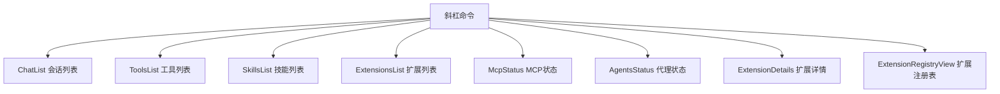

# views 架构

> 视图列表组件，以结构化方式展示工具、扩展、MCP 服务器、会话等信息

## 概述

`views` 目录包含用于展示各种列表和状态信息的视图组件。这些组件通常由对应的斜杠命令触发，以历史记录条目的形式显示在对话界面中。它们负责将复杂的数据结构（工具列表、扩展状态、MCP 服务器信息等）以终端友好的格式渲染出来。

## 架构图



## 目录结构

```
views/
├── ChatList.tsx               # 会话检查点列表
├── ToolsList.tsx              # 可用工具列表
├── SkillsList.tsx             # 技能列表
├── ExtensionsList.tsx         # 扩展列表及状态
├── ExtensionDetails.tsx       # 扩展详细信息
├── ExtensionRegistryView.tsx  # 扩展注册表视图
├── McpStatus.tsx              # MCP 服务器状态
└── AgentsStatus.tsx           # AI 代理状态
```

## 关键文件

| 文件 | 功能 |
|------|------|
| `McpStatus.tsx` | 展示 MCP 服务器连接状态、工具列表、提示列表、资源列表、认证状态和错误信息 |
| `ExtensionsList.tsx` | 展示所有已加载扩展及其更新状态 |
| `ToolsList.tsx` | 展示可用的内置和 MCP 工具，支持显示描述 |
| `ChatList.tsx` | 展示已保存的对话检查点列表，包含时间格式化 |
| `AgentsStatus.tsx` | 展示 AI 代理列表及其类型 |
| `ExtensionRegistryView.tsx` | 扩展注册表搜索和安装视图 |

## 内部依赖

- `../../semantic-colors` - 语义颜色
- `../../types` - ChatDetail、ToolDefinition、SkillDefinition、HistoryItemMcpStatus 等类型
- `../../constants` - MAX_MCP_RESOURCES_TO_SHOW 等常量

## 外部依赖

| 包名 | 用途 |
|------|------|
| `ink` | Box、Text 组件 |
| `react` | React.FC 类型 |
| `@google/gemini-cli-core` | GeminiCLIExtension、MCPServerConfig 等核心类型 |
