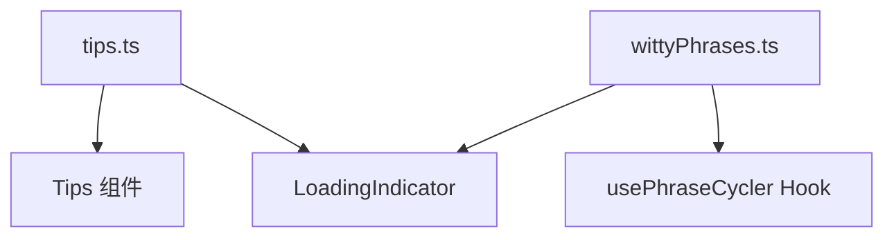

# constants 架构

> UI 常量数据，包含用户提示信息和加载时的趣味短语

## 概述

`constants` 目录存放 Gemini CLI UI 层使用的静态数据常量。主要包含两类内容：提供给用户的操作提示（tips），以及在等待 AI 响应时显示的趣味加载短语（witty phrases）。这些内容增强了 CLI 的用户体验和娱乐性。

## 架构图



## 目录结构

```
constants/
├── tips.ts           # 操作提示信息列表
└── wittyPhrases.ts   # 趣味加载短语列表
```

## 关键文件

| 文件 | 功能 |
|------|------|
| `tips.ts` | 导出 `INFORMATIVE_TIPS` 数组，包含 160+ 条提示，涵盖设置技巧、键盘快捷键和斜杠命令用法 |
| `wittyPhrases.ts` | 导出 `WITTY_LOADING_PHRASES` 数组，包含 130+ 条幽默的加载等待短语 |

## 内部依赖

无直接依赖，纯数据常量文件。

## 外部依赖

无。
