# constants.ts

> 集中定义 UI 层使用的全局数值常量、状态符号和阈值

## 概述

`constants.ts`（位于 `ui/constants.ts`，非 `ui/constants/` 目录下）是 UI 层的常量注册中心，定义了 Shell 命令相关名称、消息行数限制、工具状态符号、MCP 资源显示上限、各种定时器延迟、主题不透明度参数、URL 和性能缓存限制等常量。

## 架构图（mermaid）

```mermaid
graph TD
    A[constants.ts] --> B[Shell 相关]
    A --> C[显示限制]
    A --> D[工具状态符号]
    A --> E[定时器延迟]
    A --> F[主题不透明度]
    A --> G[URL 与缓存]

    B --> B1[SHELL_COMMAND_NAME]
    B --> B2[SHELL_NAME]
    B --> B3[SHELL_FOCUS_HINT_DELAY_MS]

    C --> C1[MAX_GEMINI_MESSAGE_LINES: 65536]
    C --> C2[MAX_MCP_RESOURCES_TO_SHOW: 10]
    C --> C3[ACTIVE_SHELL_MAX_LINES: 15]
    C --> C4[COMPLETED_SHELL_MAX_LINES: 15]
    C --> C5[SUBAGENT_MAX_LINES: 15]

    D --> D1[SUCCESS: ✓]
    D --> D2[PENDING: o]
    D --> D3[EXECUTING: ⊷]
    D --> D4[CONFIRMING: ?]
    D --> D5[CANCELED: -]
    D --> D6[ERROR: x]

    F --> F1[DEFAULT_BACKGROUND_OPACITY: 0.16]
    F --> F2[DEFAULT_INPUT_BACKGROUND_OPACITY: 0.24]
    F --> F3[DEFAULT_SELECTION_OPACITY: 0.2]
    F --> F4[DEFAULT_BORDER_OPACITY: 0.4]
```

## 主要导出

| 名称 | 值 | 说明 |
|------|-----|------|
| `SHELL_COMMAND_NAME` | `'Shell Command'` | Shell 命令显示名称 |
| `SHELL_NAME` | `'Shell'` | Shell 简称 |
| `MAX_GEMINI_MESSAGE_LINES` | `65536` | Gemini 响应最大行数限制 |
| `SHELL_FOCUS_HINT_DELAY_MS` | `5000` | Shell 焦点提示延迟 |
| `TOOL_STATUS` | `object` | 工具状态 Unicode 符号映射 |
| `MAX_MCP_RESOURCES_TO_SHOW` | `10` | MCP 资源显示上限 |
| `WARNING_PROMPT_DURATION_MS` | `3000` | 警告提示持续时间 |
| `QUEUE_ERROR_DISPLAY_DURATION_MS` | `3000` | 队列错误显示时间 |
| `DEFAULT_BACKGROUND_OPACITY` | `0.16` | 默认背景不透明度 |
| `DEFAULT_INPUT_BACKGROUND_OPACITY` | `0.24` | 输入框背景不透明度 |
| `DEFAULT_SELECTION_OPACITY` | `0.2` | 选中状态不透明度 |
| `DEFAULT_BORDER_OPACITY` | `0.4` | 边框不透明度 |
| `KEYBOARD_SHORTCUTS_URL` | `string` | 键盘快捷键文档 URL |
| `LRU_BUFFER_PERF_CACHE_LIMIT` | `20000` | LRU 缓存性能限制 |
| `MIN_TERMINAL_WIDTH_FOR_FULL_LABEL` | `100` | 显示完整上下文标签的最小终端宽度 |
| `DEFAULT_COMPRESSION_THRESHOLD` | `0.5` | 默认压缩触发阈值 |

## 核心逻辑

纯常量定义文件，无逻辑代码。

## 内部依赖

无

## 外部依赖

无
