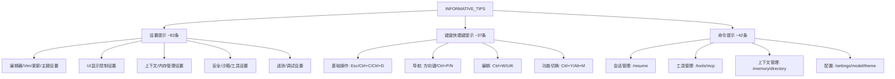

# tips.ts

> 定义 CLI 加载界面显示的信息类提示文本列表

## 概述

`tips.ts` 导出一个包含 160+ 条用户提示的字符串数组 `INFORMATIVE_TIPS`，这些提示按类别组织：设置提示、键盘快捷键提示和命令提示。在 CLI 加载等待时随机展示，帮助用户发现新功能和快捷操作。

## 架构图（mermaid）

## 主要导出

| 名称 | 类型 | 说明 |
|------|------|------|
| `INFORMATIVE_TIPS` | `string[]` | 信息提示文本数组，每条以省略号结尾 |

## 核心逻辑

纯数据定义文件。提示内容涵盖：
- **设置提示**：指导用户通过 `/settings` 或 `settings.json` 进行各项配置
- **键盘快捷键提示**：介绍常用的快捷键操作
- **命令提示**：介绍各种斜杠命令的用法

## 内部依赖

无

## 外部依赖

无
