# contexts 架构

> React Context 集合，提供 Gemini CLI 全局状态的跨组件共享

## 概述

`contexts` 目录包含 Gemini CLI 所有的 React Context 定义。这些 Context 构成了应用的全局状态管理层，将 AppContainer 中初始化的状态和操作函数向下传递给深层组件。Context 按职责划分为 UI 状态、UI 操作、配置、会话、键盘、鼠标、主题流式状态等多个维度。

## 架构图

```mermaid
graph TD
    AppContainer[AppContainer] --> UIStateContext[UIStateContext 全量UI状态]
    AppContainer --> UIActionsContext[UIActionsContext UI操作回调]
    AppContainer --> ConfigContext[ConfigContext 配置]
    AppContainer --> AppContext[AppContext 应用元信息]
    AppContainer --> ToolActionsContext[ToolActionsContext 工具操作]
    AppContainer --> ShellFocusContext[ShellFocusContext Shell焦点]
    AppContainer --> StreamingContext[StreamingContext 流式状态]

    Providers[全局 Providers] --> KeypressContext[KeypressContext 键盘事件]
    Providers --> MouseContext[MouseContext 鼠标事件]
    Providers --> VimModeContext[VimModeContext Vim模式]
    Providers --> OverflowContext[OverflowContext 溢出管理]
    Providers --> SettingsContext[SettingsContext 设置]
    Providers --> SessionContext[SessionContext 会话统计]
    Providers --> TerminalContext[TerminalContext 终端信息]
    Providers --> ScrollProvider[ScrollProvider 滚动管理]
    Providers --> AskUserActionsContext[AskUserActionsContext 用户交互]
```



## 目录结构

```
contexts/
├── UIStateContext.tsx        # 全量 UI 状态（超大接口，包含所有界面状态）
├── UIActionsContext.tsx      # UI 操作回调函数集合
├── ConfigContext.tsx          # Config 配置对象
├── AppContext.tsx             # 应用元信息（版本、启动警告）
├── ToolActionsContext.tsx     # 工具操作（批准/拒绝/批量操作）
├── KeypressContext.tsx        # 键盘事件分发和优先级处理
├── MouseContext.tsx           # 鼠标事件处理
├── VimModeContext.tsx         # Vim 模式状态管理
├── OverflowContext.tsx        # 内容溢出状态管理
├── StreamingContext.tsx       # AI 响应流式状态
├── SettingsContext.tsx        # 设置读写
├── SessionContext.tsx         # 会话统计（token 使用量、总花费等）
├── TerminalContext.tsx        # 终端信息（尺寸等）
├── ScrollProvider.tsx         # 滚动状态和拖拽管理
├── ShellFocusContext.tsx      # Shell 终端焦点状态
└── AskUserActionsContext.tsx  # 用户交互操作（确认/取消）
```

## 关键文件

| 文件 | 功能 |
|------|------|
| `UIStateContext.tsx` | 定义 UIState 超大接口（120+ 字段），包含所有 UI 状态：认证、对话、主题、设置、工具、Shell 等 |
| `UIActionsContext.tsx` | 定义 UIActions 接口，包含所有 UI 操作回调：主题选择、认证选择、对话提交、清屏等 |
| `KeypressContext.tsx` | 键盘事件处理核心，实现 ANSI 转义序列解析、优先级分发、粘贴模式、Kitty 键盘协议支持 |
| `ConfigContext.tsx` | 提供 Config 配置对象的 Context |
| `ToolActionsContext.tsx` | 工具操作 Provider，提供批准/拒绝单个或批量工具调用的回调 |
| `VimModeContext.tsx` | Vim 模式状态，管理 vimEnabled 和 vimMode (NORMAL/INSERT) |
| `OverflowContext.tsx` | 内容溢出追踪，管理哪些组件内容被截断 |
| `SessionContext.tsx` | 会话统计 Provider，追踪 token 使用量和其他会话级指标 |
| `SettingsContext.tsx` | 设置读写 Context，支持多作用域设置管理 |
| `ScrollProvider.tsx` | 滚动管理，支持键盘滚动和鼠标拖拽滚动条 |

## 内部依赖

- `../types` - HistoryItem、StreamingState、ConfirmationRequest 等类型
- `../commands/types` - CommandContext、SlashCommand
- `../components/shared/text-buffer` - TextBuffer 类型
- `../state/extensions` - ExtensionUpdateState
- `../utils/input` - ESC 常量
- `../utils/mouse` - 鼠标事件解析
- `../hooks/useFocus` - FOCUS_IN/FOCUS_OUT 常量
- `../../config/settings` - LoadedSettings、SettingScope
- `../../utils/events` - appEvents、AppEvent

## 外部依赖

| 包名 | 用途 |
|------|------|
| `react` | createContext、useContext、useState、useCallback、useEffect、useRef |
| `ink` | useStdin、DOMElement 类型 |
| `mnemonist` | MultiMap（用于 KeypressContext 的优先级多重映射） |
| `@google/gemini-cli-core` | Config、IdeContext、ApprovalMode 等核心类型 |
