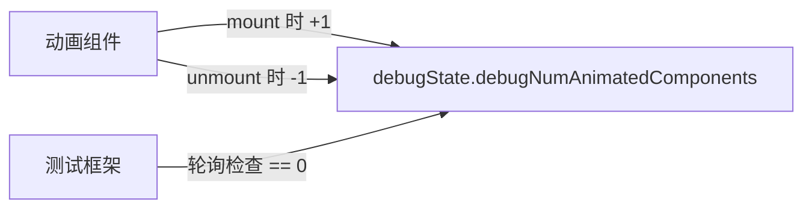

# debug.ts

> 提供全局调试状态，用于跟踪活跃动画组件数量

## 概述

`debug.ts` 是一个极其简单的模块，导出一个包含 `debugNumAnimatedComponents` 计数器的全局状态对象。该计数器用于测试环境中追踪当前活跃的动画组件数量，确保测试能够在所有动画完成后再进行断言。

## 架构图（mermaid）

## 主要导出

| 名称 | 类型 | 说明 |
|------|------|------|
| `debugState` | `object` | 包含 `debugNumAnimatedComponents: number` 的可变状态对象 |

## 核心逻辑

- 仅声明一个带有 `debugNumAnimatedComponents` 属性的对象，初始值为 `0`
- 动画组件在挂载/卸载时应自行递增/递减该计数器

## 内部依赖

无

## 外部依赖

无
